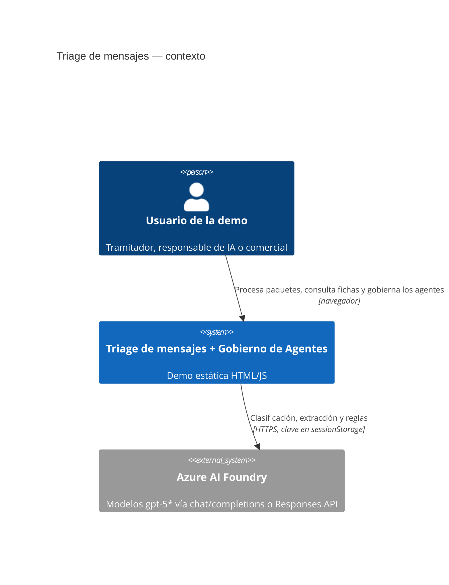
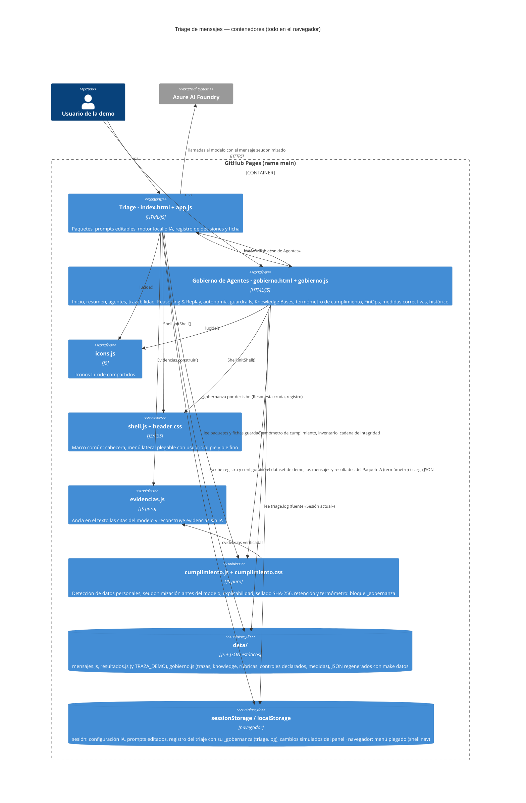
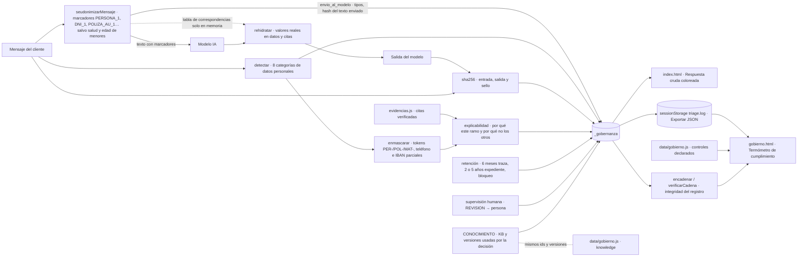

# Arquitectura (C4)

Demo estática servida por GitHub Pages: dos páginas HTML sin backend que comparten el marco visual (cabecera, menú lateral y pie: `header.css` + `shell.js`), los iconos, los datos y dos módulos de lógica pura (`evidencias.js` y `cumplimiento.js`). La única dependencia externa es Azure AI Foundry cuando el usuario configura una clave.

## Nivel 1 · Contexto



## Nivel 2 · Contenedores



## Nivel 3 · Componentes del panel de gobierno

```mermaid
flowchart LR
  subgraph fuentes[Fuentes de datos]
    demo[data/gobierno.js · GOBIERNO_DEMO]
    json[Archivo JSON cargado]
    sesion[sessionStorage triage.log]
  end
  demo --> G[(dataset activo G)]
  json --> G
  sesion -->|trazasDesdeSesion| G
  G --> inicio[Inicio · portada con una ficha por sección]
  inicio -. clic en ficha .-> resumen
  G --> resumen[Resumen · 8 KPI, agentes, coste vs cap, alertas de todas las fuentes, cumplimiento, conocimiento]
  kb -. alertas .-> resumen
  cumpl -. alertas y resumen .-> resumen
  G --> agentes[Agentes · una pestaña por agente con su ficha completa, índice de calidad y contrato]
  G --> trazas[Trazabilidad · panel fijo + lista filtrable]
  G --> replay[Reasoning & Replay · lista + pasos por agente + diff]
  G --> autonomia[Autonomía · KPI, niveles L0–L3 con sus agentes, auditoría]
  G --> guardrails[Guardrails · condiciones, disparos, toggles]
  G --> kb[Knowledge Bases · inventario, salud, comparativa de configuraciones, rúbricas]
  kb -. clic en tarjeta .-> mKb([Modal · ficha de la KB])
  kb -. editar rúbrica .-> mRub([Modal · editor de rúbrica])
  mRub -. guardar .-> estado4[(sessionStorage gobierno.rubricas y kb_acciones)]
  kb -. AI Act art. 10 y RGPD art. 17 .-> cumpl
  G --> cumpl[Termómetro de cumplimiento · marcos, matriz norma→control, ciclo de vida, inventario, cadena]
  G --> finops[FinOps · caps, coste por agente, modelos, recomendaciones]
  G --> medidas[Medidas correctivas · problemas de todas las secciones con alternativas, prioridad y ahorro conseguido]
  finops -. caps superados .-> medidas
  kb -. KB degradadas y rúbricas .-> medidas
  cumpl -. controles parciales .-> medidas
  medidas -. clic en medida .-> mMed([Modal · ficha de la medida])
  medidas -. aplicar / verificar .-> estado5[(sessionStorage gobierno.medidas)]
  medidas -. aplicar medida de coste .-> estado3
  estado5 -. controles verificados .-> cumpl
  G --> historico[Histórico · línea de tiempo por tipo de evento]
  resumen -. clic en traza .-> mTraza([Modal · ficha explicada de la traza])
  resumen -. clic en agente .-> agentes
  agentes -. kill switch .-> estado
  resumen -. kill switch .-> estado[(sessionStorage gobierno.estados)]
  guardrails -. clic en fila .-> mGr([Modal · ficha del guardrail])
  guardrails -. nuevo .-> mGrN([Modal · nuevo guardrail])
  guardrails -. toggle .-> estado2[(sessionStorage gobierno.gr_nuevos y overrides)]
  finops -. clic en KPI .-> mKpi([Modal · detalle del KPI])
  finops -. clic en cap .-> mCap([Modal · ficha del cap])
  finops -. nuevo .-> mCapN([Modal · nuevo cap])
  finops -. aplicar acción correctiva .-> estado3[(sessionStorage gobierno.correctivas y caps_nuevos)]
  autonomia -. clic en cambio .-> mCambio([Modal · registro del cambio de nivel])
  cumpl -. clic en fila del inventario .-> mCmp([Modal · ficha de cumplimiento de la traza])
  mTraza -. botón Cumplimiento .-> mCmp
```

## Nivel 3 · Componentes de la capa de cumplimiento

Una sola fuente de verdad para las dos páginas: `cumplimiento.js` calcula el bloque `_gobernanza` de cada decisión a partir del mensaje y de la salida del modelo, de forma determinista (no se le pide al modelo). La ficha del triaje lo muestra en «Respuesta cruda» y lo guarda en el registro; el panel lo lee del registro (fuente «Sesión actual») o lo recalcula para las 13 trazas de la demo. Como el hash de entrada y el de salida dependen solo del texto y de la respuesta, coinciden en las dos páginas.



Las acciones del operador en el panel (kill switch, guardrails, caps nuevos, acciones correctivas, medidas aplicadas o verificadas, acciones sobre las Knowledge Bases y rúbricas editadas) se guardan en `sessionStorage` y dejan un evento en el histórico. El estado plegado del menú lateral es una preferencia del navegador (`localStorage`, clave `shell.nav`) y se comparte entre las dos páginas. Ver [guia-demo.md](guia-demo.md) para la guía funcional de cada pantalla.

Esquema del dataset (`data/gobierno-paquete-A.json`): `version`, `periodo`, `precios{modelo:{in,out}}`, `agentes[]` (con `historial[]`, `modelos[]`, `variables[]`), `niveles[]`, `politicas[]` (con `descripcion`, `severidad`, `disparos_dia[]`, `ultimos[]`), `cambios_autonomia[]`, `caps[]`, `kpis`, `alertas[]`, `modelos[]` (consumo, `coste_por_agente`, `exito`), `trazas[]` (cada una con `motivo` y `spans: [[agente, inicio_ms, duracion_ms, modelo, tok_in, tok_out, tok_reasoning]]`), `razonamiento{trazaId: pasos[]}`, `replays[]`, `diario[[fecha, mensajes, [€ por agente]]]`, `eventos[]`, `recomendaciones[]`, `cumplimiento_declarado{ria, rgpd, dora, eiopa}` (controles documentales del Termómetro de cumplimiento), `knowledge[]` (KB con `fuente`, `config`, `metricas`, `serie`, `comparativa`, `uso`, `versiones`, `evaluacion`; mismos ids y versiones que `Cumplimiento.CONOCIMIENTO`) y `rubricas[]` (`criterios[[nombre, peso, descripción]]`, `preguntas[[pregunta, tipo, esperado, fuentes]]`, `acuerdo`, `historial`) y `medidas[]` (`dim`, `sev`, `agente`, `impacto`, `origen`, `controles`, `kb` y `alternativas[]` con `titulo`, `impacto`, `efecto`, `esfuerzo`, `aprueba`, `valida`, `rec`, `corr` —enlace a la acción correctiva de un cap, `CAP-03:1`— y `ahorro_mes`). Los dos JSON de `data/` se regeneran con `make datos`.
