# Por qué ahora

Todas las empresas prueban agentes. Muy pocas los tienen en producción.

## La IA agéntica llega a la empresa
<!-- layout: kpi -->
<!-- notes: La IA ya no es un experimento de un departamento. Casi nueve de cada diez organizaciones la usan en alguna función, y más de la mitad está probando agentes.

Y la tendencia va a más. Gartner calcula que en 2028:

- un tercio de las aplicaciones empresariales llevará agentes dentro;
- y que el 15 % de las decisiones del día a día las tomará un agente sin intervención humana.

Eso cambia la naturaleza del problema. Un chatbot responde preguntas. Un agente decide y ejecuta acciones sobre sistemas reales: abre un expediente, aprueba una solicitud, modifica un pedido.

A remarcar: cuando la IA pasa de responder a decidir, la pregunta deja de ser si funciona y pasa a ser quién responde de lo que hace. -->

Los agentes ya no solo responden: deciden y actúan sobre sistemas de negocio.

- **88 %** de las organizaciones usa IA en al menos una función de negocio (McKinsey, 2025)
- **62 %** ya usa o experimenta con agentes de IA (McKinsey, 2025)
- **33 %** de las aplicaciones empresariales incluirá IA agéntica en 2028 (Gartner)
- **15 %** de las decisiones del día a día se tomarán de forma autónoma en 2028 (Gartner)

## Del piloto a producción
<!-- layout: kpi -->
<!-- notes: Datos complementarios (no están en la diapositiva): solo un 39 % de las organizaciones ve algún impacto en el EBIT (McKinsey); un estudio del MIT sitúa en torno al 5 % los pilotos de IA generativa con impacto rápido en ingresos; en seguros, más del 90 % de las aseguradoras evalúa IA generativa y solo el 22 % la tiene en producción (Conning).

Aquí está la paradoja. Mucha experimentación y muy poca producción.

- Seis de cada diez empresas experimentan con agentes.
- Solo una de cada cuatro los está escalando, y en ninguna función concreta pasa del 10 %.
- Gartner prevé que más del 40 % de los proyectos agénticos se cancelarán antes de que acabe 2027.

Fijaos en las tres causas que da Gartner: costes, valor poco claro y controles de riesgo insuficientes. Ninguna es que el modelo no sea lo bastante bueno.

En seguros, que es el sector de los ejemplos de hoy, pasa lo mismo: casi todas las aseguradoras evalúan IA generativa y apenas una de cada cinco la tiene en producción.

A remarcar: los proyectos no mueren porque la IA falle; mueren porque nadie puede demostrar que está bajo control ni cuánto cuesta.

Nota interna: la cifra del MIT es polémica (muestra pequeña y metodología discutida). Usarla como dato complementario, no como argumento central. -->

Por qué se cancelan, según Gartner: costes que se disparan, valor de negocio poco claro y controles de riesgo insuficientes.

- **62 %** experimenta con agentes (McKinsey, 2025)
- **23 %** los está escalando en alguna parte de la empresa; en ninguna función pasa del 10 % (McKinsey, 2025)
- **>40 %** de los proyectos agénticos se cancelará antes de finales de 2027 (Gartner)

## Cuatro preguntas sin respuesta
<!-- notes: Cuando un proyecto de agentes llega al comité de riesgos, o al CFO, siempre aparecen las mismas preguntas:

- ¿Por qué decidió eso el agente?
- ¿Quién lo controla y quién responde si se equivoca?
- ¿Cuánto cuesta cada decisión?
- ¿Cómo sé que hoy funciona igual de bien que el día que lo aprobamos?

Si no hay respuesta a estas cuatro preguntas, el proyecto no pasa a producción. Y si pasa, es un riesgo.

Estas cuatro preguntas son el hilo de toda la presentación. Cada capacidad que veremos después responde a una o varias de ellas.

A remarcar: la cuarta pregunta es la más olvidada y la que más diferencia a un agente del software tradicional. -->

La observabilidad y el gobierno son lo que permite responder a estas cuatro preguntas.

- **¿Por qué decidió eso?**: explicabilidad. El cliente, el auditor o el regulador pueden preguntarlo.
- **¿Quién lo controla?**: autonomía, límites, responsables y capacidad de pararlo.
- **¿Cuánto cuesta?**: coste por decisión y por agente, no una factura mensual del proveedor.
- **¿Sigue funcionando igual que ayer?**: un agente puede degradarse sin que nadie cambie una línea de código.

# Qué cambia con los agentes

Un agente puede cambiar de comportamiento sin que nadie toque su código.

## Software tradicional frente a agente
<!-- notes: Con el software de siempre, si nadie despliega código nuevo, el sistema se comporta igual. Un agente no.

Su comportamiento puede cambiar por cuatro motivos sin que nadie toque el código:

- el proveedor actualiza el modelo;
- cambia la documentación o el conocimiento que consulta;
- alguien ajusta un prompt o una regla;
- o simplemente llegan casos nuevos, escritos de otra forma.

Además, cuando un agente se equivoca no lanza una excepción. Da una respuesta que parece correcta. Por eso no basta con vigilar si el sistema está caído o no.

A remarcar: el error de un agente no se ve; hay que buscarlo. Y eso exige otra forma de observar. -->

Un agente cambia sin tocar su código: lo cambian el modelo, el conocimiento, los prompts y los casos nuevos que llegan.

| | Software tradicional | Agente de IA |
|---|---|---|
| Comportamiento | Determinista: misma entrada, misma salida | Probabilístico: puede variar con la misma entrada |
| Qué lo cambia | Un despliegue de código | El modelo, el prompt, el conocimiento, los datos y el propio lenguaje |
| Errores | Excepciones y fallos visibles | Respuestas plausibles pero incorrectas |
| Lógica | Está en el código y se puede leer | Está en el modelo; hay que registrarla para poder explicarla |
| Coste | Fijo, por infraestructura | Variable, por token y por razonamiento |

## Riesgos nuevos
<!-- notes: Los agentes traen riesgos que los equipos de TI no tenían en su mapa:

- El modelo puede inventar un dato para completar una respuesta.
- La calidad puede degradarse poco a poco, sin un fallo evidente.
- El coste puede dispararse: un agente que razona demasiado, o que entra en un bucle de reintentos.
- Un agente con permisos de más es una puerta abierta.
- Un texto de entrada puede llevar instrucciones escondidas para manipular al agente.
- Y el modelo es un servicio de un tercero, con su disponibilidad y sus cambios de versión.

Ninguno de estos riesgos se detecta mirando solo la CPU, la memoria o los errores HTTP.

A remarcar: cada uno de estos riesgos tiene una capacidad de gobierno que lo mitiga; las veremos en el bloque 04. -->

- **Decisiones erróneas o inventadas**: el modelo rellena huecos con datos que no existen.
- **Deriva**: la calidad baja poco a poco tras un cambio de modelo, de prompt o de datos.
- **Coste desbocado**: tokens de razonamiento, reintentos y bucles entre agentes.
- **Permisos excesivos**: un agente con más acceso del que necesita para su función.
- **Prompt injection**: instrucciones maliciosas escondidas en un correo, un documento o una web.
- **Dependencia de terceros**: el proveedor del modelo es un tercero crítico.

## Monitorizar no es observar
<!-- notes: Monitorizar es saber si el sistema está vivo: si responde, cuánto tarda, si da errores. Es necesario, pero en un agente no es suficiente.

Observar un agente es poder reconstruir por qué tomó una decisión:

- qué entendió;
- qué información consultó;
- qué reglas aplicó;
- qué opciones descartó.

Y eso no lo da un log técnico. Hay que diseñarlo desde el principio, como parte del agente.

A remarcar: si la observabilidad no se diseña desde el primer día, después no se puede reconstruir el porqué de una decisión pasada. -->

El objetivo no es sacar logs del agente, sino construir una traza semántica de cada decisión.

| Monitorización técnica | Observabilidad cognitiva |
|---|---|
| ¿Está funcionando? | ¿Está decidiendo bien? |
| Latencia, errores, disponibilidad, tokens | Intención interpretada, datos usados, reglas aplicadas, alternativas descartadas |
| Responde a qué pasó | Responde a por qué pasó |
| Para el equipo técnico | Para negocio, riesgos, auditoría y técnico |

# Lo que exige la regulación

Lo que ya obliga hoy y lo que llega con el AI Act.

## Marco normativo
<!-- notes: Es habitual pensar que el AI Act es lo único que aplica y que todavía queda lejos. No es así.

Hoy ya obligan:

- el RGPD, con el derecho a no ser objeto de decisiones solo automatizadas y el derecho a una explicación;
- DORA y NIS2, que tratan al proveedor del modelo como un tercero crítico;
- y los supervisores sectoriales, como EIOPA en seguros.

Un matiz importante del Tribunal de Justicia de la UE: una persona que firma sin revisar no cuenta como supervisión humana. La supervisión tiene que ser real.

Lo que llega con el AI Act para los sistemas de alto riesgo, a partir de diciembre de 2027, es justo lo que vamos a ver: registro de eventos, transparencia, supervisión humana y robustez.

A remarcar:

- No todos los agentes son de alto riesgo; depende del uso. Pero quien construya hoy sin gobierno lo tendrá que rehacer en 2027.
- No decir que el AI Act obliga hoy a todo esto: la obligación de hoy viene del RGPD, DORA, NIS2 y los supervisores sectoriales. -->

### Ya en vigor

- **AI Act art. 4 y 50**: alfabetización en IA y transparencia con quien interactúa con una IA.
- **RGPD art. 22**: derecho a no ser objeto de decisiones solo automatizadas. Firmar sin revisar no es intervención humana (TJUE, SCHUFA).
- **RGPD art. 15**: derecho a una explicación con sentido de la lógica aplicada (TJUE, Dun & Bradstreet).
- **DORA y NIS2**: el proveedor del modelo es un tercero crítico.
- **Supervisores sectoriales**: por ejemplo, EIOPA en seguros (agosto de 2025).

### Lo que llega

- **AI Act, alto riesgo** (2/12/2027, Digital Omnibus): registro de eventos (art. 12), transparencia (art. 13), supervisión humana (art. 14) y robustez (art. 15).
- **Ley española de IA**: en tramitación, con AESIA como supervisora.
- **Sanciones**: hasta 35 M€ o el 7 % de la facturación global.

### Estándares de referencia

- **ISO/IEC 42001**: sistema de gestión de IA.
- **NIST AI RMF**: marco de gestión del riesgo de IA.

# Capacidades

Ver, entender, limitar, pagar y auditar.

## Qué buscamos
<!-- notes: Antes de entrar en las capacidades, conviene fijar el objetivo. Queremos que cada agente en producción sea:

- fiable, porque funciona de forma estable;
- medible, porque sabemos qué aporta al negocio;
- auditable, porque podemos reconstruir cualquier decisión;
- gobernable, porque controlamos cuánta libertad tiene;
- y evolutivo, porque mejora con datos y no con intuiciones.

A remarcar: desplegar un agente es fácil; operarlo como un sistema crítico de la empresa es lo difícil. -->

No se trata de desplegar un agente, sino de industrializar su operación.

- **Fiable**: estable y con el rendimiento esperado.
- **Medible**: con su impacto real en el negocio cuantificado.
- **Auditable**: cualquier decisión se puede reconstruir y justificar.
- **Gobernable**: se controla su evolución, su autonomía y su comportamiento.
- **Evolutiva**: mejora de forma continua a partir de evidencia.

## Arquitectura de referencia
<!-- notes: La arquitectura que proponemos tiene tres capas.

Arriba, agentes pequeños y especializados. En el ejemplo de seguros son cuatro: uno recibe los mensajes, otro los clasifica, otro extrae los datos y otro aplica las reglas de negocio. Cada uno tiene su modelo, su prompt y sus propios límites.

En medio, una capa de gobierno común a todos los agentes. Es la que da las trazas, el replay, la autonomía, los guardrails, el control de costes y el histórico.

Abajo, la instrumentación. Usamos OpenTelemetry, que es el estándar abierto, para generar los datos. Así las herramientas de observabilidad solo consumen esos datos, y se pueden cambiar sin tocar el agente.

A remarcar: no es una IA que lo hace todo; son especialistas con límites claros sobre una capa de gobierno común. -->

No es una IA que lo hace todo: son especialistas con límites claros sobre una capa de gobierno común.

### Agentes especializados

- Una sola función por agente, con su modelo, su prompt y sus límites.
- Ejemplo en seguros: recepción multicanal → clasificación → extracción → reglas de negocio.

### Capa de gobierno común

- Trazas, replay, autonomía, guardrails, FinOps e histórico.
- Los mismos controles para todos los agentes, no uno por proyecto.

### Instrumentación estándar

- OpenTelemetry genera trazas, métricas y logs.
- Las herramientas de explotación (CloudWatch, Azure Monitor, Datadog, Langfuse…) consumen los datos: se cambian sin tocar el agente.

## Tres niveles de observabilidad
<!-- notes: Cada perfil de la empresa necesita mirar al agente desde un ángulo distinto. Por eso organizamos la observabilidad en tres niveles.

- El técnico responde a si el sistema funciona.
- El operativo responde a si el agente aporta valor al negocio.
- El cognitivo responde a si el agente decide bien y por qué.

La clave es que los tres niveles comparten el mismo identificador de traza. Por ejemplo: vemos que la latencia sube, comprobamos que eso ha hecho crecer los escalados a personas y encontramos la causa en el razonamiento de un agente concreto.

A remarcar: tres vistas, un solo dato de origen; nada de tres herramientas que no se hablan. -->

Un mismo trace_id une los tres: del problema técnico a su impacto en negocio y a su causa en el razonamiento.

| | Nivel 1 · Técnica | Nivel 2 · Operativa | Nivel 3 · Cognitiva |
|---|---|---|---|
| Pregunta | ¿Funciona? | ¿Aporta? | ¿Decide bien? |
| Qué mide | Latencia, errores, disponibilidad, tokens | Automatización, escalados, precisión, tiempo de resolución | Intención, datos usados, reglas, decisiones intermedias, alternativas descartadas |
| Quién lo usa | Equipos técnicos | Negocio y operación | Riesgos, compliance y auditoría |
| Valor | Prevenir degradaciones y cumplir SLA | Ver el retorno del proyecto | Explicar y auditar cada decisión |

## Mapa de capacidades
<!-- notes: Este es el mapa del bloque. Agrupamos las capacidades en seis verbos:

- ver lo que pasa;
- entender por qué pasa;
- limitar lo que el agente puede hacer solo;
- conocer con qué conocimiento decide y si sigue siendo bueno;
- pagar solo lo que tiene sentido pagar;
- y auditar todo lo anterior.

Lo que vais a ver a continuación son capturas de una plataforma de gobierno que hemos construido sobre un caso de seguros: el triaje de avisos de siniestro con cuatro agentes. Pero todas las capacidades son las mismas para cualquier proceso.

A remarcar: cada capacidad responde a una de las cuatro preguntas del principio. -->

Cada capacidad responde a una de las cuatro preguntas del principio.

| Ver | Entender | Limitar | Conocer | Pagar | Auditar |
|---|---|---|---|---|---|
| ¿Qué está pasando? | ¿Por qué decidió eso? | ¿Quién lo controla? | ¿Con qué conocimiento decide? | ¿Cuánto cuesta? | ¿Podemos demostrarlo? |
| Portada · Vista de dirección · Trazabilidad | Explicabilidad · Evidencias · Reasoning Replay · Causa raíz | Identidad y permisos · Autonomía · Trust Score · Guardrails · Kill switch | Knowledge bases · Rúbricas | Caps · Acciones correctivas · Modelos · Simulación | Libro de registro · Cumplimiento · Prueba en cada decisión · Termómetro |

## Ver: la portada del panel
<!-- notes: Antes de entrar en detalle, esta es la portada del panel. Cada ficha corresponde a una sección y responde a una pregunta: qué pasa, por qué, con qué límites, con qué conocimiento, si cumple y cuánto cuesta.

Cada ficha lleva dos cifras en vivo y un semáforo. Si algo va mal, se ve aquí antes de abrir nada.

A remarcar: la portada no es decoración; es la forma de que cualquiera sepa en qué sección tiene que entrar. -->

Una ficha por pregunta, con su estado en vivo.

- **Una puerta de entrada**: diez fichas agrupadas en ver, entender, limitar, conocer, cumplimiento, costes y auditar.
- **Dos cifras en vivo por ficha**: calculadas con los mismos datos que su sección, y un semáforo si hay algo que mirar.
- **La norma de cada bloque**: las etiquetas de cada ficha dicen a qué artículo responde.

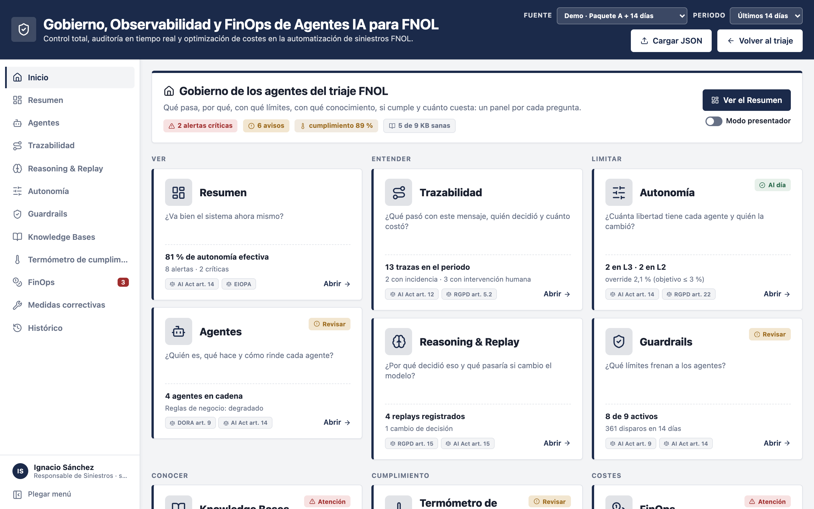

## Ver: la vista de dirección
<!-- notes: Esta es la primera pantalla, pensada para dirección.

En la fila de arriba están los indicadores clave. En el ejemplo: el 81 % de las decisiones se toman sin intervención humana, el 19 % se escalan a una persona, y las personas corrigen al agente en el 2,1 % de los casos, por debajo del objetivo del 3 %.

Debajo, cada agente con su modelo, su versión de prompt, su nivel de autonomía y su coste del día. Fijaos en el agente de Reglas: aparece como degradado porque ha superado su límite de coste diario y el sistema lo ha pasado automáticamente a un modelo más barato.

A remarcar: no hace falta ser técnico para leer esta pantalla; está pensada para quien tiene que decidir. -->

En diez segundos se sabe si el sistema va bien.

- **El estado del sistema en una pantalla**: mensajes, autonomía efectiva, escalados, overrides, coste frente al cap, alertas, cumplimiento y conocimiento.
- **Una tarjeta por agente**: modelo, versión de prompt, nivel de autonomía, estado y coste del día frente a su límite.
- **Alertas de todas las fuentes**: coste, conocimiento y cumplimiento, cada una con su causa y lo que ya se ha hecho.

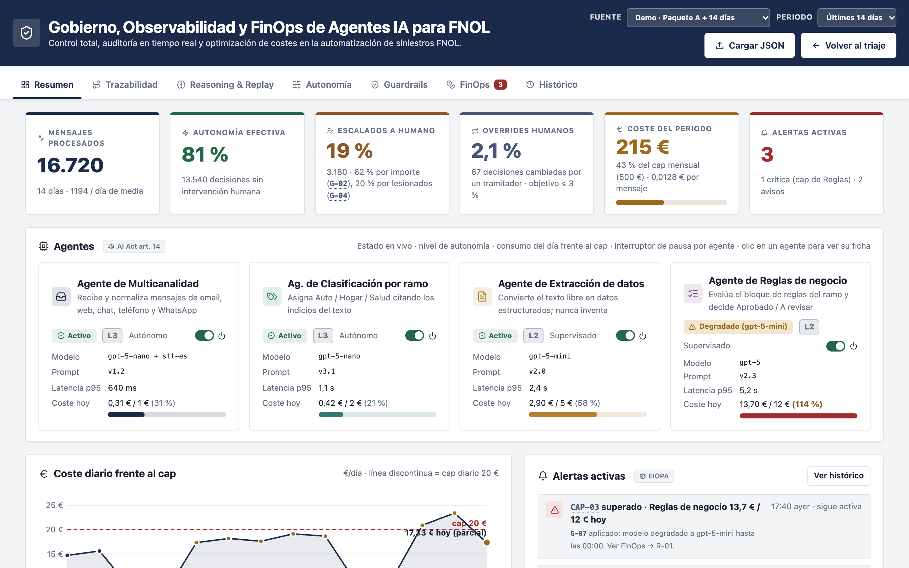

## Ver: trazabilidad de extremo a extremo
<!-- notes: Esta es la auditoría mensaje a mensaje.

A la izquierda vemos la cadena de agentes en cascada: cuánto tardó cada uno, con qué modelo y cuántos tokens consumió. A la derecha, los datos de la traza: canal, confianza, guardrail disparado, versiones de cada agente y coste total.

En este caso hay algo más: una persona corrigió la decisión del agente. Queda registrado quién lo hizo, cuándo y por qué. Y el motivo es interesante: el agente no tenía acceso a un dato que sí estaba en el sistema de pólizas. Eso no es un error del modelo, es una mejora de integración pendiente.

A remarcar: con un solo identificador se responde a la pregunta «¿qué pasó con este caso, quién decidió y cuánto costó?». -->

Con un solo identificador: qué pasó con este caso, quién decidió y cuánto costó.

1. **Entrada**: mensaje original, canal y contexto.
2. **Interpretación**: intención, clasificación, confianza y alternativas descartadas.
3. **Ejecución**: agentes invocados, reglas y decisiones intermedias.
4. **Conocimiento**: fuentes consultadas y su relevancia.
5. **Modelo**: prompt, respuesta, latencia y tokens.
6. **Acción**: lo que se ejecutó en los sistemas de negocio.
7. **Resultado**: decisión final, escalado y corrección humana.

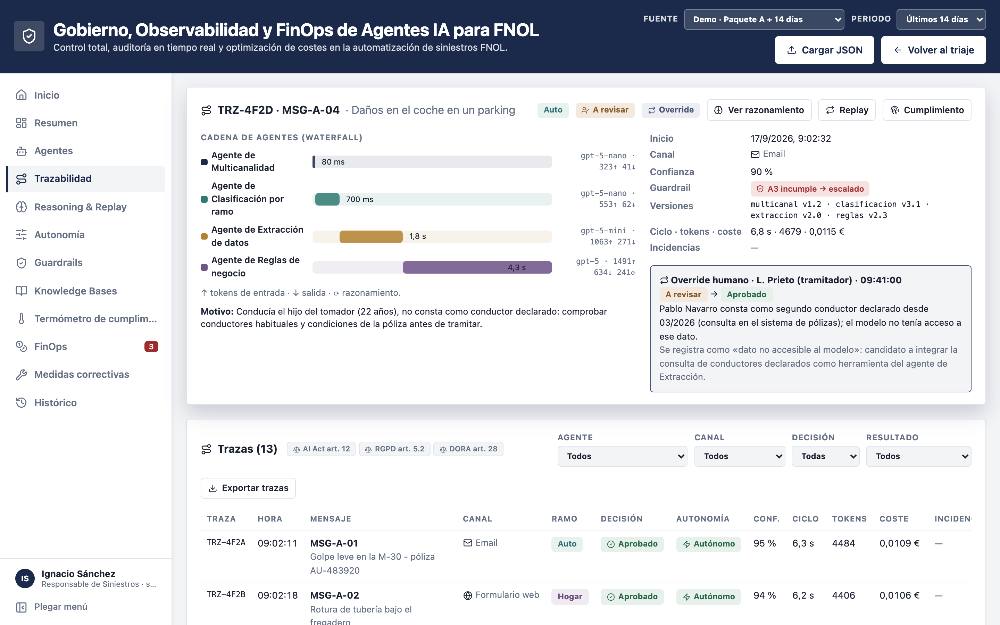

## Entender: explicabilidad
<!-- notes: La explicabilidad no consiste en enseñar el log. Consiste en contar, en lenguaje de negocio, qué pasó.

En esta ficha se lee de arriba abajo:

- qué llegó: un mensaje por WhatsApp diciendo que han entrado a robar en casa;
- qué hizo cada agente: lo clasificó como Hogar, extrajo los datos sin inventar ninguno y detectó que faltaban cuatro;
- qué se decidió: revisión por una persona, porque falta información esencial;
- y qué guardrail lo provocó.

Esto es lo que permite cumplir el derecho a una explicación del RGPD, y lo que da confianza a los equipos que trabajan con el agente.

A remarcar: la explicación es la propia frase del cliente y la regla aplicada, no una justificación generada a posteriori. -->

Si el cliente pregunta por qué, la respuesta está aquí.

- **En lenguaje de negocio, no de log**: qué llegó, qué hizo cada agente, qué se decidió y por qué.
- **Con la evidencia**: la regla incumplida y el dato que falta, enlazados a la traza.
- **Para quien no es técnico**: operación, atención al cliente, riesgos y auditoría.
- **Ejemplo**: «Robo en vivienda sin denuncia ni relación de objetos: falta información esencial; se solicita la denuncia y se envía perito».

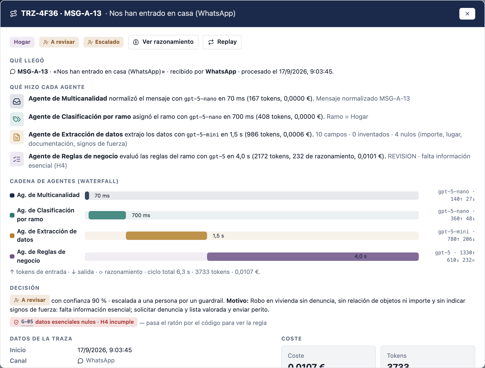

## Entender: evidencias verificadas
<!-- notes: La explicabilidad se apoya en el propio texto del cliente. El modelo devuelve citas literales y el navegador comprueba que están en el mensaje antes de resaltarlas.

Nunca se piden posiciones al modelo, porque los modelos cuentan mal los caracteres. Y si una cita no aparece, se marca como no localizada.

A remarcar: si el cliente pregunta por qué, la respuesta es su propia frase. -->

Cada dato y cada regla, con la frase literal del cliente que lo prueba.

- **El modelo cita, la plataforma comprueba**: solo se resalta una cita que aparece de verdad en el mensaje.
- **Un color por tipo de evidencia**: ramo, dato extraído, fecha, regla que se cumple y regla que se incumple.
- **Lo que falta, también**: si un dato esencial no está en el texto, se marca «no consta» y no se inventa.

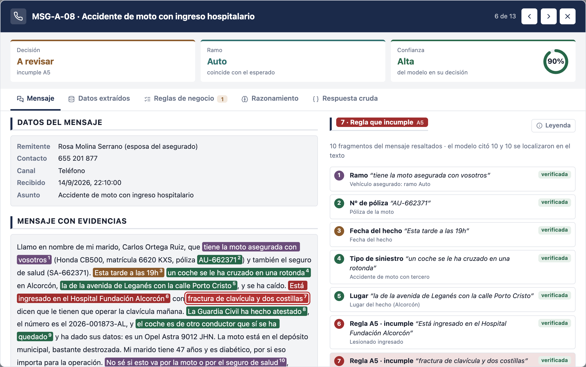

## Entender: Reasoning Replay y What-if
<!-- notes: Aquí tenemos dos capacidades.

La primera es el razonamiento registrado. Para cada agente vemos qué recibió, qué pasos siguió y qué devolvió. Ojo: no es el pensamiento interno del modelo. Es un registro estructurado que cada agente devuelve junto con su respuesta.

La segunda es el replay. Permite volver a ejecutar cualquier decisión pasada:

- En modo idéntico, para comprobar que el agente sigue decidiendo igual.
- En modo «¿y si…?», cambiando el modelo o el prompt.

En el ejemplo probamos un modelo más pequeño en el agente de Reglas. La decisión no cambia, y el coste baja más de un 80 %. Con esto hay una base objetiva para aprobar el cambio.

A remarcar: el replay convierte un cambio de modelo, que suele dar miedo, en una decisión con datos. -->

Cada cambio se prueba antes de desplegarlo, y la prueba queda registrada.

- **Razonamiento registrado**: entrada, pasos y salida de cada agente.
- **Replay idéntico**: reproduce una decisión pasada para verificar que el resultado es estable.
- **What-if**: la reproduce con otro modelo o prompt y compara decisión, coste y latencia.
- **Ejemplo**: con un modelo más pequeño en Reglas, misma decisión, −82 % de coste y −41 % de latencia.

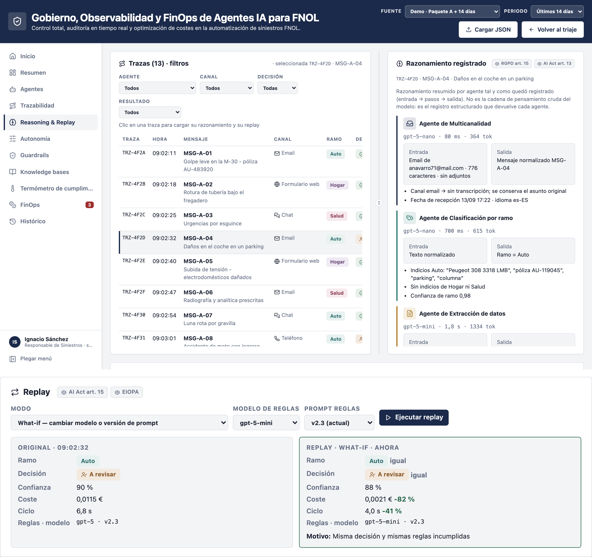

## Entender: causa raíz del comportamiento
<!-- notes: Cuando un agente se equivoca, la reacción habitual es decir «el modelo ha fallado». Casi nunca es así.

Gracias a la traza podemos saber exactamente dónde estuvo el problema. Puede que:

- el agente entendiera mal la petición;
- le llegara información incorrecta o desactualizada;
- las reglas no contemplaran ese caso;
- hubiera un fallo de integración;
- o simplemente tuviera más autonomía de la que debía para ese tipo de caso.

Cada causa tiene una solución distinta. Sin la traza, solo nos quedaría cambiar de modelo y cruzar los dedos.

A remarcar: cada interacción es una unidad de análisis; pasamos de reaccionar a incidencias a mejorar con evidencia. -->

¿Por qué se equivocó el agente? Cada causa tiene una solución distinta.

### Causas posibles

- Se interpretó mal la intención.
- El conocimiento recuperado era incorrecto o insuficiente.
- La base documental estaba desactualizada.
- El modelo hizo una inferencia inconsistente.
- Las reglas de validación no cubrían el caso.
- Hubo un fallo técnico o de integración.
- El nivel de autonomía no era el adecuado.

### Qué se obtiene

- Patrones de error.
- Procedimientos que no funcionan.
- Casos que necesitan más intervención humana.
- Mejoras concretas de prompts, reglas o conocimiento.

## Limitar: identidad y permisos por agente
<!-- notes: Cada agente tiene una ficha, igual que un empleado tiene un puesto con funciones y permisos.

En la ficha se ve:

- con qué identidad accede a los sistemas;
- quién es su responsable;
- qué datos trata y en qué región se procesan;
- y, sobre todo, qué puede hacer y qué no.

En el ejemplo, el agente de Reglas puede consultar la póliza y proponer una decisión. No puede ordenar pagos, ni rechazar un siniestro, ni modificar el expediente.

Debajo, el histórico: cada cambio de nivel, de modelo o de prompt, con su motivo y quién lo aprobó.

A remarcar: un agente con permisos de más es el riesgo de seguridad más fácil de evitar. -->

Mínimo privilegio también para los agentes.

- **Identidad propia**: credencial administrada, sin secretos en el código.
- **Un responsable**: un área de negocio y un comité que responden del agente.
- **Datos que trata y dónde**: proveedor del modelo y región.
- **Qué puede y qué no**: el agente de Reglas propone, pero no puede ordenar pagos ni rechazar un siniestro.

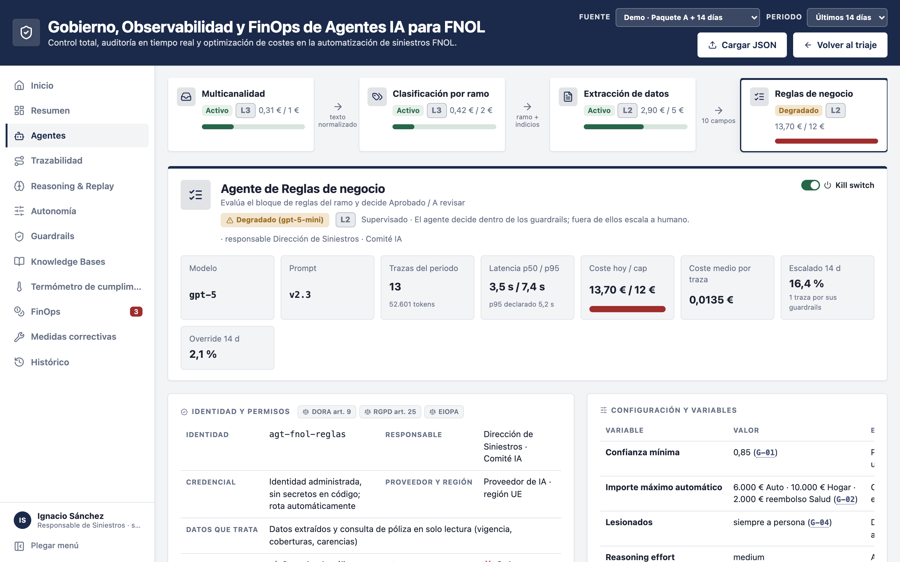

## Limitar: autonomía progresiva
<!-- notes: No todos los agentes tienen que tener la misma libertad. La autonomía se fija agente a agente, en cuatro niveles: desde manual, donde el agente solo sugiere, hasta autónomo, donde decide y ejecuta y solo se revisa después.

Lo importante es que el nivel no es una decisión de una vez. Se revisa con datos:

- El agente de Reglas empezó en L0, con una persona confirmando cada decisión.
- Subió a L2 y tuvo que volver a L1 tras aprobar importes altos que no debía; de ahí nació el guardrail de importe.
- Después subió a L2 y a L3 a medida que demostraba que coincidía con las personas.
- Cuando la tasa de correcciones humanas pasó del 3 % en una semana, volvió a L2.

En la captura de arriba está el registro de esa última bajada: el motivo, quién la aprobó, cómo estaba configurado el agente en ese momento y que el cambio es reversible. Abajo, la evolución completa del nivel, con cada subida en verde y cada bajada en rojo.

A remarcar: la autonomía es un resultado gobernado, nunca una decisión implícita. -->

La autonomía se gana con datos y se pierde con datos.

- **L0 · Manual**: el agente solo sugiere; una persona decide y ejecuta.
- **L1 · Asistido**: el agente propone; una persona confirma cada caso.
- **L2 · Supervisado**: decide dentro de los guardrails; fuera de ellos escala a una persona.
- **L3 · Autónomo**: decide y ejecuta; solo se audita a posteriori.
- **Ejemplo**: Reglas bajó de L3 a L2 al superar el 3 % de correcciones humanas.

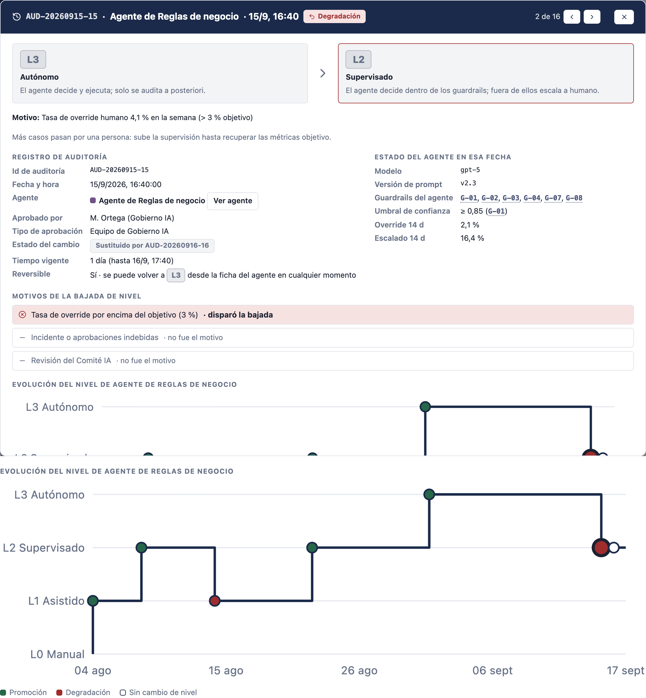

## Limitar: Trust Score y supervisión adaptativa
<!-- notes: ¿Cómo se decide si un agente merece más autonomía? Con una puntuación de confianza que se recalcula de forma continua.

Esa puntuación se alimenta de tres tipos de validación:

- La humana, que al principio es obligatoria y sirve para construir la línea base.
- La validación por resultado: no basta con que la respuesta pareciera correcta, hay que ver si el caso se reabrió, si hubo que rehacer el trabajo o si alguien la corrigió.
- Y la validación por evidencia: si la respuesta se apoyaba en fuentes válidas.

Con esa puntuación, la intervención humana se ajusta sola: obligatoria cuando la confianza es baja, selectiva cuando es media y solo de supervisión cuando es alta.

En la captura se ve la materia prima de esa puntuación para el agente de Reglas: semana a semana, su precisión sube, y los escalados y las correcciones humanas bajan. Debajo, las variables que gobiernan su comportamiento, cada una con su efecto: la confianza mínima, el importe máximo, el objetivo de override o el límite de coste.

A remarcar: el Trust Score no mide la inteligencia del modelo; mide cuánto nos podemos fiar de él en este proceso concreto. -->

Cada incremento de autonomía es medible, reversible, gobernado, auditado y justificable.

1. **Validación**: humana al principio; después por resultado (reaperturas, retrabajos, correcciones) y por evidencia (fuentes válidas).
2. **Trust Score** por agente, caso de uso y automatismo: no mide lo inteligente que es el modelo, sino cuánta confianza operativa merece.
3. **Supervisión adaptativa**: confianza baja → intervención obligatoria; media → revisión selectiva; alta → ejecución autónoma con monitorización.

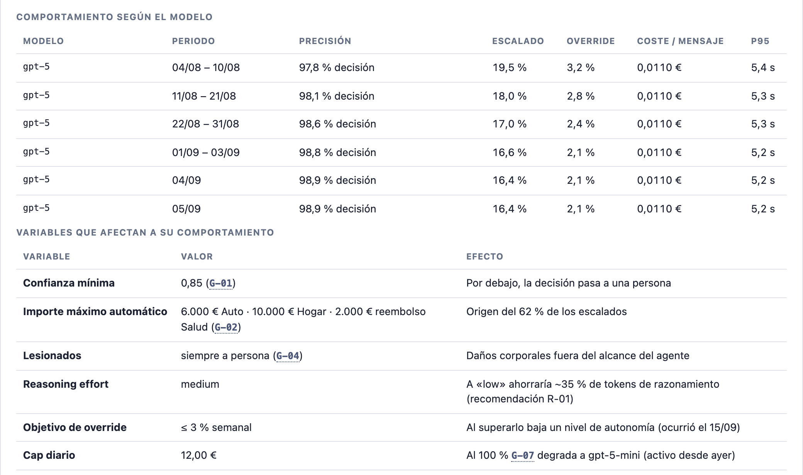

## Limitar: guardrails
<!-- notes: Los guardrails son las condiciones que limitan lo que un agente puede hacer solo. Si se cumple la condición, el agente no decide: escala a una persona, cambia de modelo o marca el caso.

Hay varios tipos:

- de confianza;
- de importe o impacto;
- de coherencia entre agentes;
- de casos sensibles;
- de datos que faltan;
- de coste;
- y de formato.

Cada guardrail tiene su propia ficha. En la captura, el guardrail de importe:

- se ha disparado 118 veces en dos semanas, unas ocho al día;
- explica un tercio de los escalados por guardrail;
- después del disparo, la persona cambia la decisión en un 3 % de los casos;
- y la resolución humana tarda una mediana de 14 minutos.

Además vemos en qué días, por qué canal y en qué ramo se dispara. Cada guardrail se puede activar o desactivar, y cada cambio queda en el histórico. Los de importe y lesionados explican la mayoría de los escalados, y eso es lo esperado: son decisiones que no queremos que tome una máquina.

A remarcar: un guardrail que no se dispara nunca sobra, y uno que se dispara siempre indica que el agente no está listo. -->

Los guardrails son lo que permite dar autonomía sin perder el control.

- **Confianza**: decisión con confianza < 0,85 → escalar.
- **Importe**: más de 6.000 € en Auto → escalar.
- **Coherencia**: los agentes no coinciden en el ramo → escalar.
- **Casos sensibles**: hay lesionados → gestión especializada.
- **Datos esenciales**: sin póliza ni fecha → pedir datos al cliente.
- **Coste**: cap diario al 100 % → modelo más barato.
- **Formato**: respuesta inválida tras dos reintentos → motor alternativo.

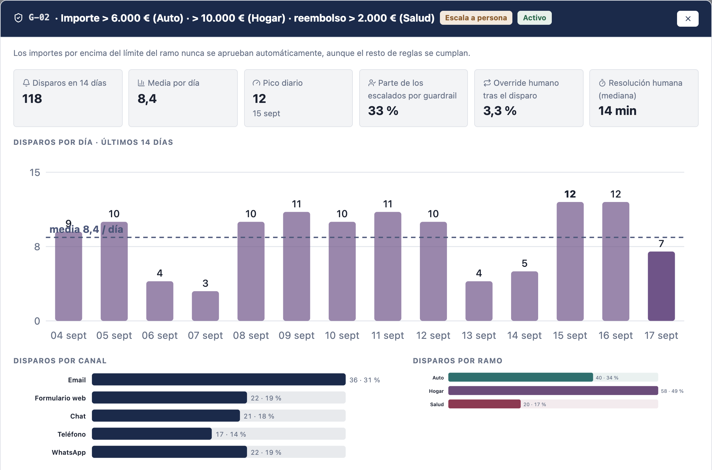

## Limitar: kill switch y resiliencia
<!-- notes: Cualquier sistema crítico necesita un botón de parada. Aquí cada agente tiene el suyo. Si un agente empieza a comportarse mal, se pausa desde el panel, y los casos que dependen de él se quedan en cola. No se pierde ninguno.

Además, la plataforma está preparada para los fallos del proveedor del modelo:

- si el proveedor está saturado, reintenta con espera creciente;
- si se llega al límite de coste, pasa a un modelo más barato;
- y si el modelo devuelve respuestas inválidas, pasa a un motor alternativo y marca el caso para revisión.

Esto es lo que piden DORA y el AI Act cuando hablan de resiliencia y de capacidad de interrumpir el sistema.

A remarcar: poder parar un agente sin parar el negocio es un requisito, no un extra. -->

Si la IA falla, el proceso sigue.

- **Kill switch por agente**: se pausa al instante desde el panel.
  - Los casos que dependen de él se encolan: no se pierde ninguno.
  - La pausa queda registrada en el histórico.
- **Resiliencia ante fallos del modelo**:
  - Reintentos con espera creciente ante saturación del proveedor.
  - Degradación a un modelo más barato al llegar al límite de coste.
  - Paso a un motor alternativo si el modelo no responde bien.

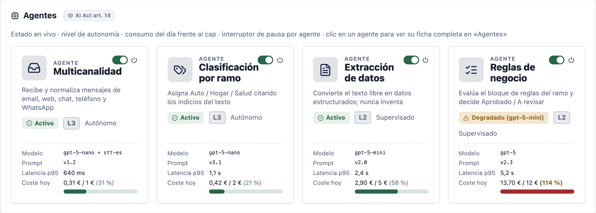

## Conocer: el conocimiento también se degrada
<!-- notes: Un agente puede estar perfecto y aun así equivocarse, porque el conocimiento que consulta se ha degradado: documentos obsoletos, duplicados, un índice que crece sin control.

En el ejemplo, alguien sincronizó 340 condicionados de 2024 y el recall cayó seis puntos. La comparativa muestra que un filtro de vigencia lo arregla.

A remarcar: el conocimiento se vigila igual que los agentes, con métricas, umbrales y versiones. -->

Los agentes deciden con conocimiento que no está en el modelo, y ese conocimiento envejece.

- **Un inventario de todo el conocimiento**: índices RAG de SharePoint o Drive, Markdown, runbooks, tablas de referencia y plantillas.
- **Salud medida contra umbrales**: recall, fidelidad, citas, frescura, obsoletos, duplicados, deriva y datos personales.
- **Comparativa de configuraciones**: el mismo corpus con distintos tamaños de chunk y solapamiento, para decidir con datos.

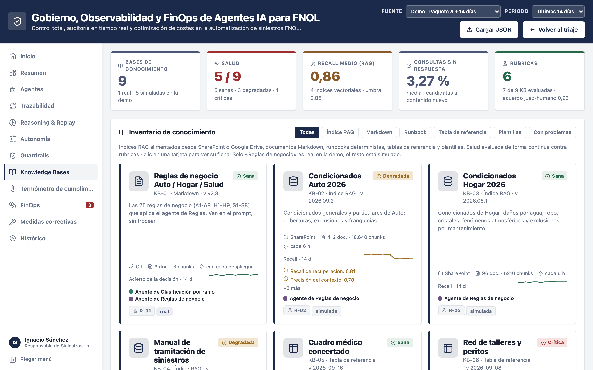

## Conocer: rúbricas que vigilan el conocimiento
<!-- notes: Las rúbricas son un activo más, versionado y con responsable. Cada una tiene sus criterios con peso y un juego de preguntas de referencia.

Se ejecutan cada noche, en cada reindexado y en cada cambio de configuración. Si una base empeora, no se publica: es una puerta de calidad.

A remarcar: si el juez y las personas dejan de coincidir, la evaluación deja de ser fiable, y el panel lo dice. -->

La salud solo es tan buena como las pruebas con las que se mide.

- **Preguntas de referencia por base**: factuales, de cláusula, de exclusión, de plazo y preguntas trampa sin respuesta.
- **Criterios con peso**: fidelidad, cláusula correcta, completitud y rechazo correcto; los pesos deben sumar 100.
- **Juez calibrado con personas**: el acuerdo entre el modelo juez y los revisores dice si la evaluación es fiable.

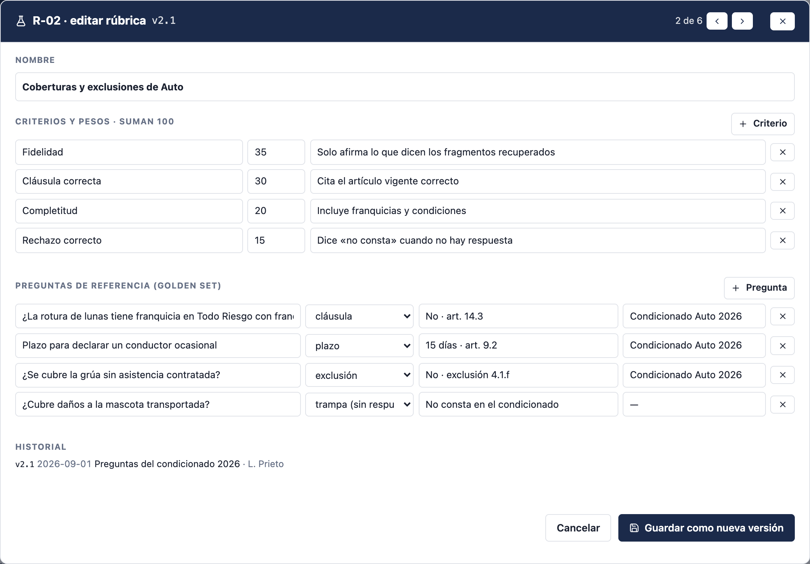

## Pagar: caps y presupuesto
<!-- notes: El coste de un agente es variable: depende de cuántos casos llegan, de lo largos que son y de cuánto tiene que razonar el modelo. Por eso hay que controlarlo en tiempo real.

Los caps son límites de gasto a varios niveles: global, por agente, por caso e incluso por tokens de razonamiento. Al 80 % avisan y al 100 % actúan.

Arriba, la ficha de un cap concreto, el del coste diario del agente de Reglas:

- hoy está al 114 % de su límite;
- en el gráfico se ve cómo ha ido acercándose al límite en los últimos días;
- y al superarlo, el guardrail vinculado ha pasado el agente a un modelo más barato, sin parar el proceso.

Abajo, la vista del mes: llevamos el 59 % del presupuesto y, al ritmo actual, cerraremos por debajo del límite.

A remarcar: sabemos lo que cuesta cada decisión, no solo lo que cuesta el mes. -->

El coste se controla por decisión, no con la factura del proveedor a fin de mes.

- **Caps a varios niveles**: global, por agente, por caso, por tokens de razonamiento y por llamadas por minuto.
- **Aviso al 80 % y acción al 100 %**: degradar el modelo, pausar lotes no urgentes o marcar el caso.
- **Cada cap enlazado** con los agentes que lo consumen y el guardrail que actúa al superarlo.
- **Proyección de cierre de mes** frente al presupuesto.

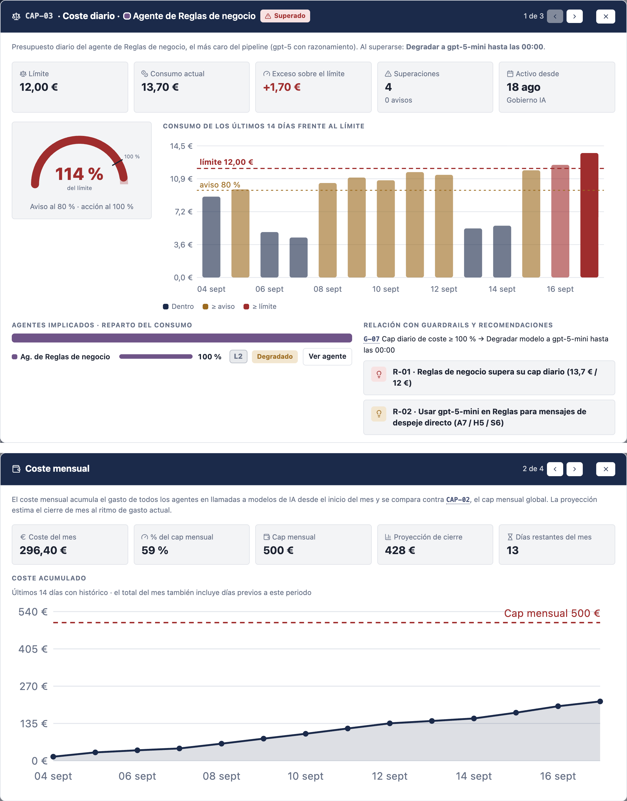

## Pagar: de la alerta a la acción
<!-- notes: Una alerta sin acción solo genera ruido. Por eso aquí cada cap superado llega con propuestas concretas.

Arriba vemos de un vistazo qué caps están por encima del 100 %, cuáles están en aviso y cuáles van bien.

Abajo, las acciones que propone la plataforma para el cap del agente de Reglas. Hay tres tipos:

- Las automáticas, que ya ha aplicado un guardrail: el agente sigue funcionando con un modelo más barato.
- Las que se pueden simular con replay antes de aplicarlas, con su ahorro estimado.
- Y las que cambian el presupuesto, que no se aplican sin la aprobación del comité.

Todo lo que se aplica queda en el histórico.

A remarcar: la plataforma propone, pero los cambios de presupuesto los aprueba una persona. -->

Cada alerta llega con su acción, su ahorro estimado y quién tiene que aprobarla.

- **Automática**: ya aplicada por un guardrail. Ejemplo: modelo más barato hasta medianoche (−82 % de coste por mensaje).
- **Simular y aplicar**: se prueba con replay antes de activarla. Ejemplo: modelo pequeño en los casos sencillos (−7,9 €/día).
- **Solicitar aprobación**: los cambios de presupuesto pasan por el comité. Ejemplo: subir el límite de 12 € a 14 €.

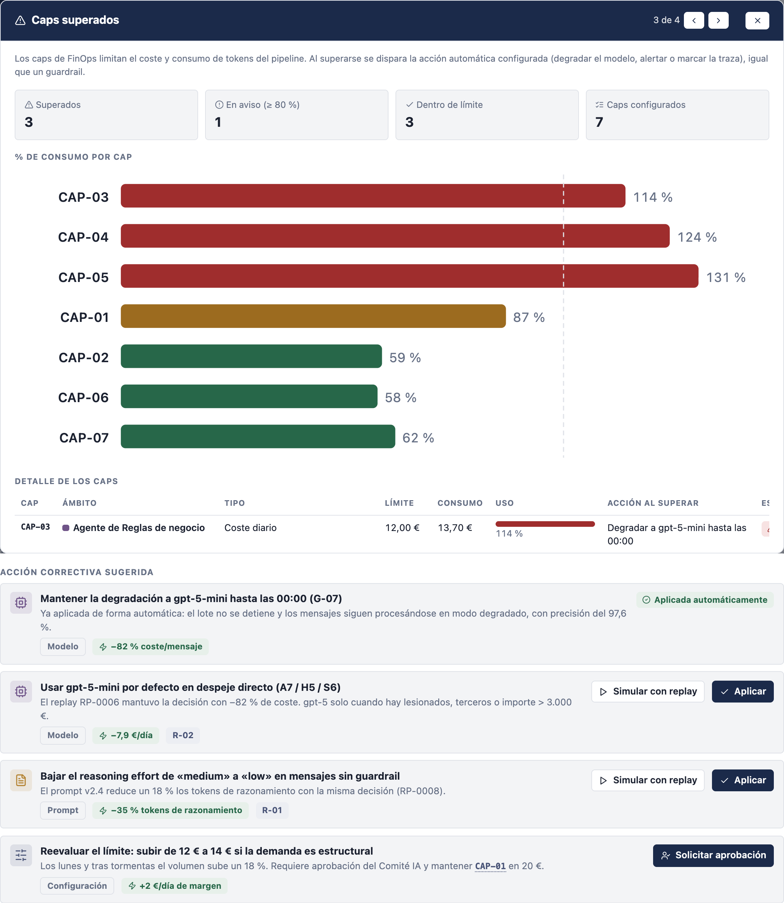

## Pagar: el modelo adecuado para cada agente
<!-- notes: Esta tabla responde a una pregunta muy concreta: ¿qué modelo uso para cada agente?

Para cada modelo vemos qué agentes lo usan, cuántas llamadas hace, cuántos tokens consume y cuánto cuesta. Y también su calidad: si devuelve respuestas válidas, si necesita reintentos, si es estable en el replay.

En el ejemplo, el agente de Reglas, con el modelo grande, se lleva el 80 % del coste. Es el candidato obvio a optimizar. Y con el replay que vimos antes podemos hacerlo sin riesgo.

A remarcar: el ahorro sale de elegir bien el modelo para cada tarea, no de usar siempre el más barato. -->

No buscamos el modelo más barato, sino el más barato que mantiene la calidad.

- **Coste frente a calidad**: precio, tokens, coste, latencia p95 y calidad de cada modelo.
- **Dónde está el gasto**: en el ejemplo, un solo agente concentra el 80 % del coste.
- **Palancas de ahorro priorizadas**: menos razonamiento, modelo pequeño en casos simples, estrategia en dos pasos y caché del prompt base.

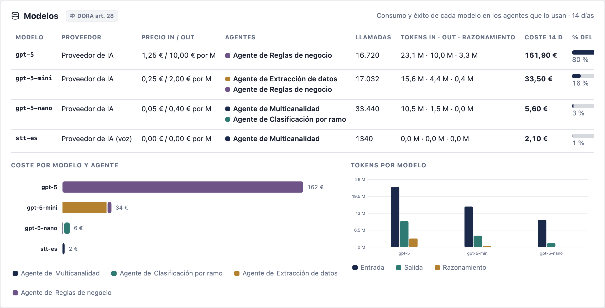

## Antes de cambiar, simular
<!-- notes: Cambiar un límite o una regla de un agente tiene consecuencias. Si pongo un límite de coste demasiado bajo, paro el negocio. Si pongo un guardrail demasiado estricto, lleno de trabajo a los equipos.

Por eso cada cambio se simula antes:

- Al crear un cap, la plataforma calcula cómo habría funcionado en las dos últimas semanas y avisa si ya existe otro parecido.
- Al crear un guardrail, estima cuántas veces se dispararía y cuántos casos más pasarían a una persona. En el ejemplo, unos 47 en dos semanas.
- Y para cambiar de modelo o de prompt, tenemos el replay que vimos antes.

A remarcar: el gobierno no es solo vigilar; es poder cambiar con seguridad. -->

Ningún cambio de gobierno llega a producción sin saber antes su impacto.

- **Nuevo cap**: cuántas veces se habría superado en los últimos 14 días y si choca con otro cap.
- **Nuevo guardrail**: cuántos disparos tendría y cuántos mensajes pasarían a una persona.
- **Cambio de modelo o de prompt**: replay What-if sobre casos reales, con la diferencia en decisión, coste y latencia.

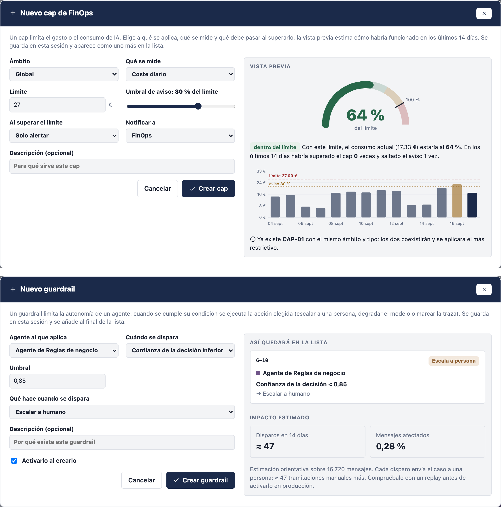

## Auditar: libro de registro
<!-- notes: Todo lo que hemos visto deja rastro en un único libro de registro.

Aquí aparece:

- cada corrección humana;
- cada incidente con el proveedor;
- cada cap superado;
- cada replay;
- cada cambio de nivel de autonomía, de modelo o de prompt.

Siempre con fecha, agente, motivo y responsable. Incluso las acciones que se hacen en directo, como pausar un agente o apagar un guardrail.

Cuando llega un auditor, no hay que preparar nada: la evidencia ya está.

A remarcar: el registro se genera solo como parte de la operación, no es un trabajo adicional del equipo. -->

Qué cambió, cuándo, por qué y quién lo aprobó. Se rellena solo, sin trabajo extra.

- **Alertas**: cap superado, aviso al 80 %.
- **Políticas y niveles**: guardrail activado, cambio de autonomía, acción correctiva aplicada.
- **Replays**: pruebas de modelo o de prompt.
- **Overrides**: decisiones del agente corregidas por una persona.
- **Despliegues**: cambios de prompt o de modelo.
- **Incidentes**: saturación del proveedor, paso a motor alternativo.

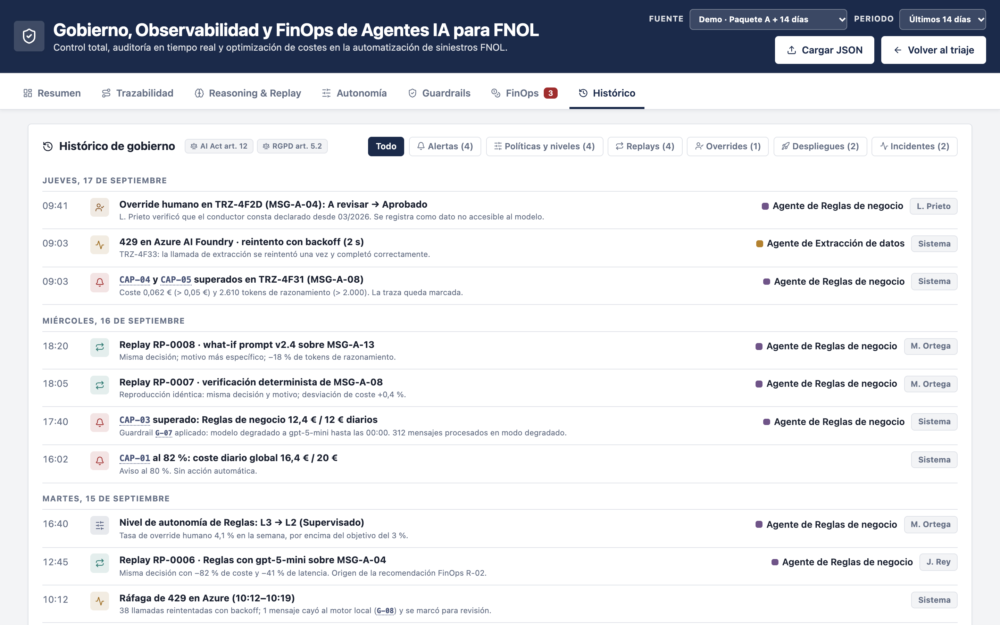

## Cumplimiento por diseño
<!-- notes: El cumplimiento no se añade al final. Cada capacidad que hemos visto responde a un artículo concreto.

En el propio panel, cada bloque lleva una etiqueta con la norma que lo respalda. Al pasar el ratón por encima explica qué pide el artículo y si ya está en vigor o solo será exigible a los sistemas de alto riesgo a partir de 2027.

Así, el equipo de compliance no tiene que traducir entre lo técnico y lo legal: la correspondencia ya está hecha.

A remarcar: compliance por defecto significa que cumplir no cuesta trabajo extra, porque lo hace la propia plataforma. -->

Cada bloque del panel lleva su etiqueta normativa: qué exige el artículo y si ya está en vigor.

- **Trazabilidad**: AI Act art. 12 · RGPD art. 5.2 y 30.
- **Explicabilidad**: RGPD art. 15 y 22 · AI Act art. 13.
- **Autonomía y supervisión humana**: AI Act art. 14 · RGPD art. 22.
- **Guardrails y resiliencia**: AI Act art. 15 · DORA.
- **Identidad y permisos**: DORA art. 9 · RGPD art. 25 y 32.
- **Gestión de modelos**: DORA art. 28.
- **FinOps**: gobierno interno (p. ej., Solvencia II art. 41 en seguros).
- **Histórico**: AI Act art. 12 · supervisores sectoriales.

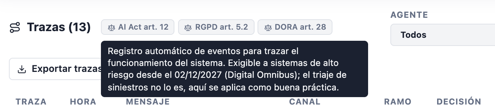

## Auditar: la prueba en cada decisión
<!-- notes: Esta es la respuesta cruda del modelo para un menor que llega a urgencias. Debajo, la plataforma añade el bloque de gobierno: los datos personales detectados y cómo se guardan, por qué es Salud y no Auto ni Hogar, el sello de la traza y cuánto tiempo se conserva.

Nada de esto lo genera el modelo. Se calcula de forma determinista y se puede recalcular en cualquier momento.

A remarcar: el modelo no se autocertifica. -->

La plataforma, no el modelo, deja en cada decisión la evidencia que pide la norma.

- **Datos personales detectados y seudonimizados**: identificativos, contacto, salud, menores y terceros, con su valor en la traza.
- **Por qué este ramo y por qué no los otros**: con las evidencias verificadas que lo justifican.
- **Sello y retención**: hash SHA-256 de entrada y salida, plazos de conservación y supervisión humana.

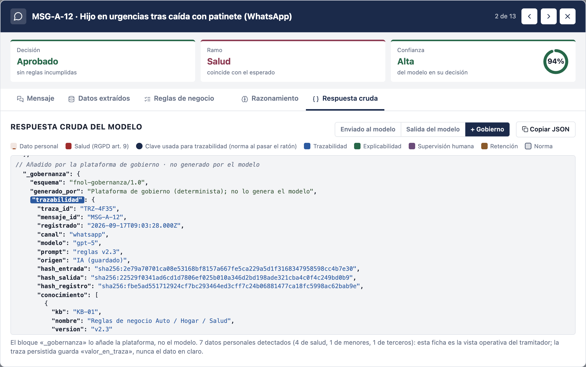

## Auditar: termómetro de cumplimiento
<!-- notes: El termómetro agrega los bloques de gobierno de todas las trazas. Cada control dice qué exige la norma, cómo lo resuelve la solución y la medida en vivo.

Hay controles en ámbar, y eso es bueno: el panel no maquilla. La minimización, por ejemplo, está en ámbar porque hoy el texto llega completo al modelo.

A remarcar: no sustituye al DPO; le da la evidencia que necesita, recalculada con cada traza. -->

Cobertura de controles con evidencia medible, no un certificado.

- **Un termómetro por marco**: AI Act, RGPD y LOPDGDD, DORA, y EIOPA y Solvencia II, con los controles en ámbar a la vista.
- **Norma, control y medida**: qué exige cada artículo, cómo se resuelve y la cifra en vivo, medida o declarada.
- **Inventario de datos e integridad**: datos personales por mensaje y una cadena de hashes que detecta cualquier alteración.

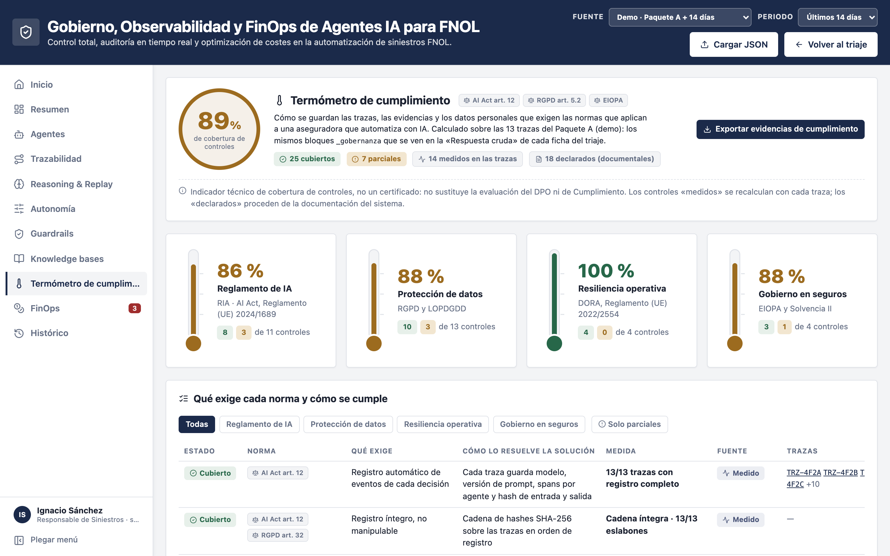

# Cómo implantarlo

De forma progresiva, con capacidades que se activan cuando el negocio lo decide.

## Marco de madurez GenAIOps
<!-- layout: proceso -->
<!-- notes: No hace falta tenerlo todo el primer día. Proponemos un camino en cinco niveles de madurez:

- Desplegado: el agente funciona y deja trazas.
- Monitorizado: detectamos desviaciones y controlamos el coste.
- Gobernado: cada cambio de prompt o de modelo se versiona, se valida y se prueba antes de desplegarlo.
- Optimizado: ajustamos con datos reales el equilibrio entre coste y calidad.
- Y mejora continua asistida: las correcciones de las personas alimentan la evolución del agente, siempre bajo control.

Cada empresa decide hasta dónde llega y a qué ritmo.

A remarcar: el nivel 3 es el mínimo razonable para un agente que toma decisiones con impacto en clientes. -->

Las capacidades no se imponen: se activan por decisión del cliente, nivel a nivel.

1. **Desplegado**: agentes integrados, trazabilidad básica y criterios mínimos de producción.
2. **Monitorizado**: detección de desviaciones, métricas de calidad, alertas y control de costes.
3. **Gobernado**: versionado de prompts, validación y regresión antes de cada cambio.
4. **Optimizado**: ajustes con datos reales y equilibrio entre coste y calidad.
5. **Mejora continua asistida**: las correcciones humanas alimentan la evolución, siempre bajo gobierno.

## Cadena de confianza operacional
<!-- layout: proceso -->
<!-- notes: Si juntamos todo lo anterior, aparece una cadena:

- Cada interacción deja una traza.
- La traza permite explicar la decisión.
- La explicación, junto con la validación, se convierte en evidencia.
- La evidencia alimenta la puntuación de confianza.
- Y la confianza decide cuánta autonomía tiene el agente.

Y alrededor, el ciclo de mejora: observamos, analizamos, ajustamos, validamos con replay y desplegamos.

Esto es lo que convierte un chatbot en una plataforma de agentes gobernada.

A remarcar: la autonomía no se concede, se demuestra. -->

Ciclo de mejora: observar → analizar → ajustar → validar con replay → desplegar.

1. **Traza**: cada interacción queda registrada de extremo a extremo.
2. **Explicación**: el razonamiento se reconstruye en lenguaje de negocio.
3. **Evidencia**: validación humana, por resultado y por fuentes.
4. **Trust Score**: la evidencia se convierte en confianza medible.
5. **Autonomía**: la intervención humana se ajusta a esa confianza.

## Piezas sueltas frente a integración
<!-- notes: Es justo reconocer que en el mercado hay buenas herramientas: plataformas de observabilidad de modelos, plataformas de gobierno y riesgo, y un estándar abierto para trazar llamadas a modelos.

Lo que falta es unirlas al negocio de cada empresa: a su proceso, a sus reglas, a su contabilidad de costes y a su marco normativo.

Eso es lo que aportamos: no una licencia más, sino una forma de implementar agentes que ya viene con la observabilidad y el gobierno integrados.

A remarcar: no decir que no existe nada en el mercado. Existen piezas; lo que falta es integrarlas con el negocio. -->

No es un producto: es una forma de implementar agentes en una empresa regulada, integrada con su proceso, sus reglas y sus costes.

### Hay piezas sueltas

- **Observabilidad de LLM**: Langfuse, Arize o Datadog: trazas, latencia y tokens.
- **Gobierno y riesgo de IA**: IBM watsonx.governance o Credo AI: inventario y políticas.
- **Estándar OpenTelemetry GenAI**: convenciones comunes para trazar llamadas a modelos.

### Nadie las une a tu negocio

- **Tu proceso**: de la entrada a la decisión, de punta a punta.
- **Tus reglas de negocio**: con la evidencia de cada criterio.
- **Tus costes**: coste por decisión y límites de gasto por agente.
- **Tu marco normativo**: cada capacidad enlazada con la norma que aplica.

## Mensajes clave
<!-- layout: tarjetas -->
<!-- notes: Si os tenéis que quedar con algo, que sea esto:

- El problema ya no es tecnológico, es de confianza.
- Un agente puede empeorar sin que nadie toque su código, y eso solo se ve con observabilidad cognitiva.
- La regulación ya exige hoy trazabilidad, explicación y supervisión humana real.
- El gobierno se resuelve con cinco capacidades sobre una capa común a todos los agentes.
- Y la autonomía de un agente no se decide por intuición: se gana y se pierde con datos.

A remarcar: volver a las cuatro preguntas del principio y comprobar que todas tienen respuesta. -->

- **Confianza**: el reto ya no es si la IA puede hacerlo, sino si se puede poner en producción con confianza.
- **Observabilidad cognitiva**: un agente cambia sin cambiar su código; la monitorización técnica no basta.
- **Regulación**: ya pide trazabilidad, explicación y supervisión humana real, y el AI Act lo endurece en 2027.
- **Cinco capacidades**: ver, entender, limitar, pagar y auditar, sobre una capa común.
- **Autonomía**: se gana con datos y se pierde con datos.

## Fuentes
<!-- notes: Fuentes de las cifras y de la normativa citadas en la presentación. -->

- McKinsey, [The state of AI in 2025: Agents, innovation, and transformation](https://www.mckinsey.com/capabilities/quantumblack/our-insights/the-state-of-ai)
- Gartner, [nota de prensa del 25/06/2025 sobre IA agéntica](https://www.gartner.com/en/newsroom/press-releases/2025-06-25-gartner-predicts-over-40-percent-of-agentic-ai-projects-will-be-canceled-by-end-of-2027)
- Fortune, [informe del MIT NANDA «The GenAI Divide» (18/08/2025)](https://fortune.com/2025/08/18/mit-report-95-percent-generative-ai-pilots-at-companies-failing-cfo/)
- Conning, [AI in Insurance 2025](https://conning.com/about-us/news/ir-pr---ai-survey-2025)
- Normativa: [AI Act](https://eur-lex.europa.eu/eli/reg/2024/1689/oj) · [RGPD](https://eur-lex.europa.eu/eli/reg/2016/679/oj) · [DORA](https://eur-lex.europa.eu/eli/reg/2022/2554/oj) · [NIS2](https://eur-lex.europa.eu/eli/dir/2022/2555/oj) · [Digital Omnibus](https://www.gibsondunn.com/eu-ai-act-omnibus-agreement-postponed-high-risk-deadlines-and-other-key-changes/)
- Jurisprudencia: [TJUE C-634/21 (SCHUFA)](https://curia.europa.eu/juris/liste.jsf?num=C-634/21) · [TJUE C-203/22 (Dun & Bradstreet)](https://curia.europa.eu/juris/liste.jsf?num=C-203/22)
- Supervisores y estándares: [EIOPA, Opinion on AI governance](https://www.eiopa.europa.eu/eiopa-publishes-opinion-ai-governance-and-risk-management-2025-08-06_en) · [ISO/IEC 42001](https://www.iso.org/standard/42001) · [NIST AI RMF](https://www.nist.gov/itl/ai-risk-management-framework)
