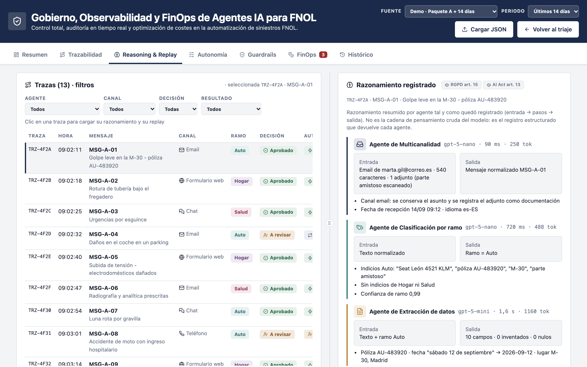
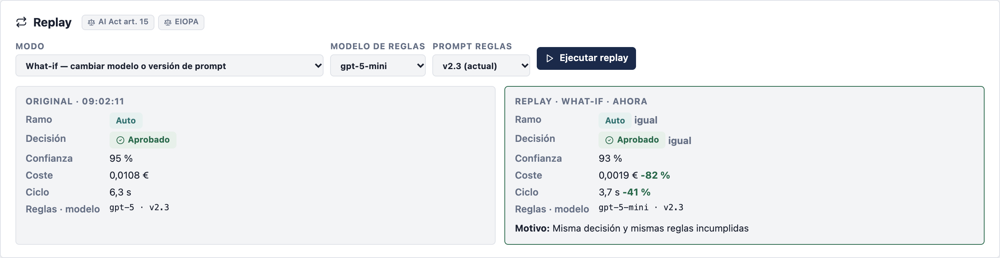
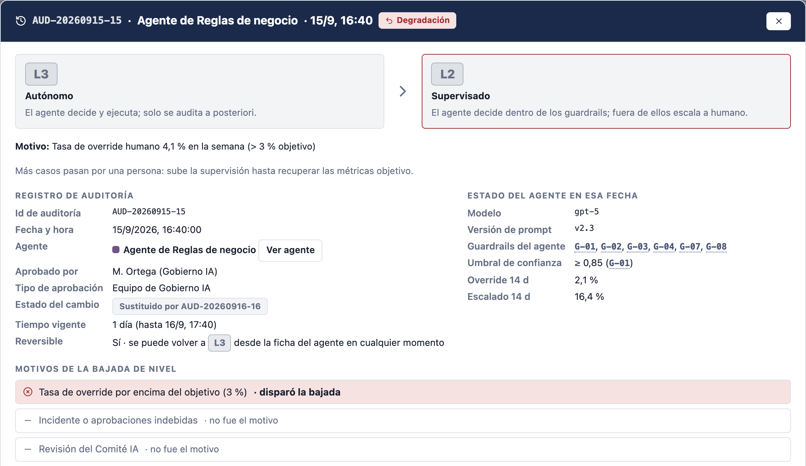
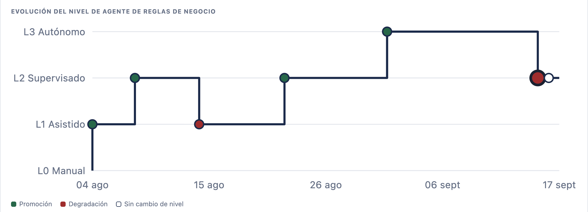
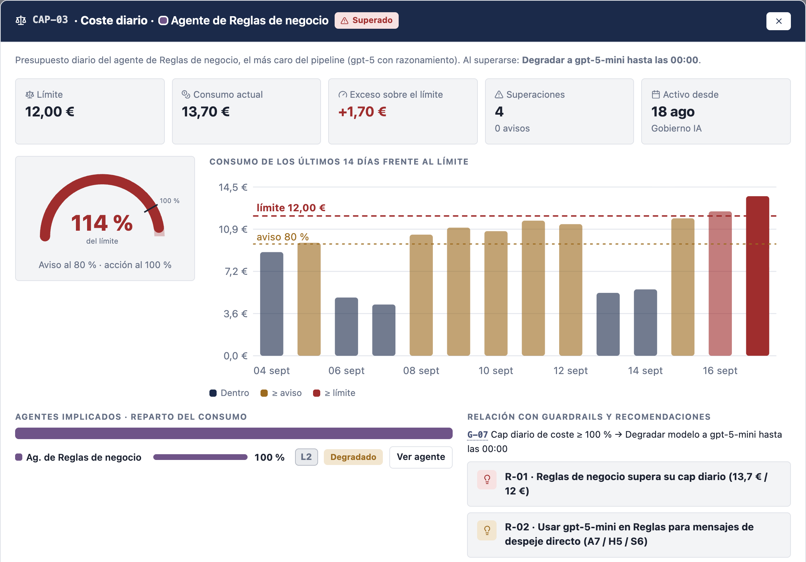
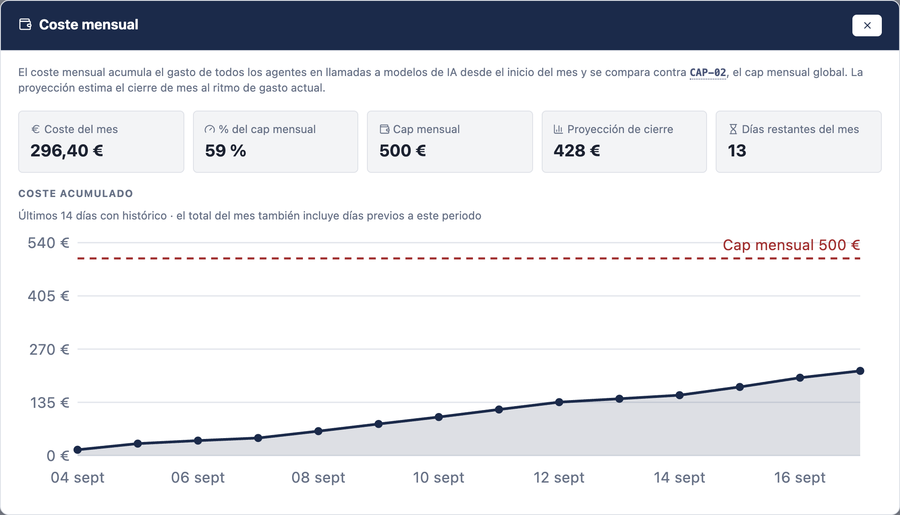
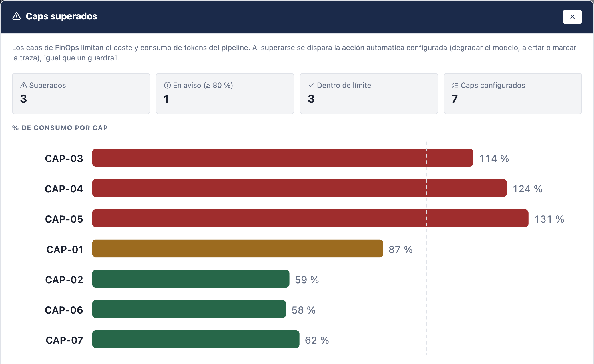
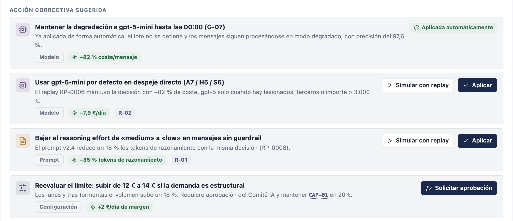
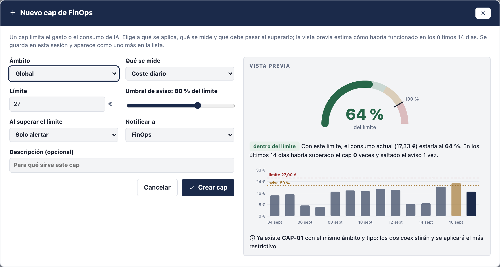
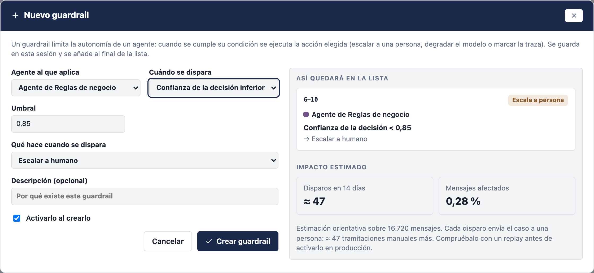

# Slides: Observabilidad y gobierno de la IA agéntica

Presentación genérica sobre las capacidades de observabilidad y gobierno que necesita una plataforma de IA agéntica en una empresa. Los ejemplos y las capturas vienen de la demo de triaje de siniestros (FNOL) de este repositorio, pero el discurso vale para cualquier sector.

Este fichero es el contenido de referencia: texto, capturas y notas del ponente de cada slide, sin estilo. Iconos de [Lucide](https://lucide.dev). Capturas en [img/observabilidad/](img/observabilidad/), sacadas de `gobierno.html` con la fuente «Demo · Paquete A + 14 días».

**Versión en PowerPoint** (plantilla Logicalis 2026, modo avanzado de la skill md-to-pptx): [slides-observabilidad.pptx](slides-observabilidad.pptx), 60 slides. Se genera así:

| Fichero | Qué es |
|---|---|
| [slides-observabilidad-pptx.md](slides-observabilidad-pptx.md) | Copia de este contenido con la sintaxis de la skill (frontmatter, `#` para secciones, directivas `layout` y `notes`). Es la entrada del build |
| [build_slides_observabilidad.py](build_slides_observabilidad.py) | Ejecuta la skill y añade las slides de captura ampliada (pie de foto y nota de cada una) |

```bash
python3 build_slides_observabilidad.py
```

Diferencias del .pptx respecto a este fichero, por limitaciones de la plantilla:

- La agenda y la contraportada las genera la plantilla.
- Las fuentes de cada slide se agrupan en la slide «Fuentes». En las slides de cifras (4 y 5) solo aparecen las cifras; los datos complementarios de la 5 van en sus notas.
- En las slides con captura, la plantilla no admite tabla e imagen a la vez: las tablas de esas slides van en viñetas.
- Las slides con dos capturas muestran ambas apiladas en una sola imagen (`c21`, `c24`, `c28`, `c29` y `c31` en `img/observabilidad/`); las slides ampliadas siguientes las muestran por separado.

Si se cambia el contenido, hay que actualizar también `slides-observabilidad-pptx.md` y, si afecta a las capturas ampliadas, la tabla `AMPLIADAS` del script.

| Nº | Diapositiva | Tipo |
|---|---|---|
| 1 | Portada | Contenido |
| 2 | Agenda | Agenda |
| 3 | Separador 01 · Por qué ahora | Contenido |
| 4 | La IA agéntica llega a la empresa | Contenido |
| 5 | Del piloto a producción | Contenido |
| 6 | Cuatro preguntas sin respuesta | Contenido |
| 7 | Separador 02 · Qué cambia con los agentes | Contenido |
| 8 | Software tradicional frente a agente | Contenido |
| 9 | Riesgos nuevos | Contenido |
| 10 | Monitorizar no es observar | Contenido |
| 11 | Separador 03 · Lo que exige la regulación | Contenido |
| 12 | Marco normativo | Contenido |
| 13 | Separador 04 · Capacidades | Contenido |
| 14 | Qué buscamos | Contenido |
| 15 | Arquitectura de referencia | Contenido |
| 16 | Tres niveles de observabilidad | Contenido |
| 17 | Mapa de capacidades | Contenido |
| 18 | Ver: la vista de dirección | Contenido + captura |
| 19 | Ver: la vista de dirección | Captura ampliada |
| 20 | Ver: trazabilidad de extremo a extremo | Contenido + captura |
| 21 | Ver: trazabilidad de extremo a extremo | Captura ampliada |
| 22 | Entender: explicabilidad | Contenido + captura |
| 23 | Entender: explicabilidad | Captura ampliada |
| 24 | Entender: Reasoning Replay y What-if | Contenido + captura |
| 25 | Entender: Reasoning Replay y What-if (1/2) | Captura ampliada |
| 26 | Entender: Reasoning Replay y What-if (2/2) | Captura ampliada |
| 27 | Entender: causa raíz del comportamiento | Contenido |
| 28 | Limitar: identidad y permisos por agente | Contenido + captura |
| 29 | Limitar: identidad y permisos por agente | Captura ampliada |
| 30 | Limitar: autonomía progresiva | Contenido + captura |
| 31 | Limitar: autonomía progresiva (1/2) | Captura ampliada |
| 32 | Limitar: autonomía progresiva (2/2) | Captura ampliada |
| 33 | Limitar: Trust Score y supervisión adaptativa | Contenido |
| 34 | Limitar: Trust Score y supervisión adaptativa | Captura ampliada |
| 35 | Limitar: guardrails | Contenido + captura |
| 36 | Limitar: guardrails | Captura ampliada |
| 37 | Limitar: kill switch y resiliencia | Contenido + captura |
| 38 | Limitar: kill switch y resiliencia | Captura ampliada |
| 39 | Pagar: caps y presupuesto | Contenido + captura |
| 40 | Pagar: caps y presupuesto (1/2) | Captura ampliada |
| 41 | Pagar: caps y presupuesto (2/2) | Captura ampliada |
| 42 | Pagar: de la alerta a la acción | Contenido + captura |
| 43 | Pagar: de la alerta a la acción (1/2) | Captura ampliada |
| 44 | Pagar: de la alerta a la acción (2/2) | Captura ampliada |
| 45 | Pagar: el modelo adecuado para cada agente | Contenido + captura |
| 46 | Pagar: el modelo adecuado para cada agente | Captura ampliada |
| 47 | Antes de cambiar, simular | Contenido + captura |
| 48 | Antes de cambiar, simular (1/2) | Captura ampliada |
| 49 | Antes de cambiar, simular (2/2) | Captura ampliada |
| 50 | Auditar: libro de registro | Contenido + captura |
| 51 | Auditar: libro de registro | Captura ampliada |
| 52 | Cumplimiento por diseño | Contenido + captura |
| 53 | Cumplimiento por diseño | Captura ampliada |
| 54 | Separador 05 · Cómo implantarlo | Contenido |
| 55 | Marco de madurez GenAIOps | Contenido |
| 56 | Cadena de confianza operacional | Contenido |
| 57 | Piezas sueltas frente a integración | Contenido |
| 58 | Mensajes clave | Contenido |
| 59 | Fuentes | Contenido |
| 60 | Gracias | Cierre |

---

## 1 · Portada

**Observabilidad y gobierno de la IA agéntica**
De agentes que funcionan a agentes en los que se puede confiar.

> **Notas del ponente:**
>
> Hoy no vamos a hablar de si la IA es capaz de hacer una tarea. Eso ya está demostrado en casi cualquier proceso.
>
> Vamos a hablar de lo que pasa después: cómo se pone un agente en producción, cómo se sabe lo que hace, cómo se controla y cuánto cuesta.
>
> **A remarcar:** el reto ya no es tecnológico, es de confianza.

---

## 2 · Agenda

01 Por qué ahora · 02 Qué cambia con los agentes · 03 Lo que exige la regulación · 04 Capacidades · 05 Cómo implantarlo

> **Notas del ponente:**
>
> El recorrido tiene cinco partes:
>
> - Primero, por qué este tema es urgente ahora.
> - Después, qué tienen de distinto los agentes frente al software de siempre.
> - Tercero, qué pide ya la regulación.
> - Cuarto, el bloque principal: las capacidades de observabilidad y gobierno, con capturas de una plataforma real.
> - Y por último, cómo se implanta de forma progresiva.

---

## 3 · Separador 01 · Por qué ahora

Todas las empresas prueban agentes. Muy pocas los tienen en producción.

---

## 4 · La IA agéntica llega a la empresa

Cuatro cifras, cada una con su icono:

| Icono | Cifra | Descripción | Fuente |
|---|---|---|---|
| `building-2` | **88 %** | de las organizaciones usa IA en al menos una función de negocio | ¹ |
| `bot` | **62 %** | ya usa o experimenta con agentes de IA | ¹ |
| `app-window` | **33 %** | de las aplicaciones empresariales incluirá IA agéntica en 2028 (menos del 1 % en 2024) | ² |
| `git-branch` | **15 %** | de las decisiones del día a día se tomarán de forma autónoma en 2028 | ² |

**Los agentes ya no solo responden: deciden y actúan sobre sistemas de negocio.**

Fuentes: ¹ [McKinsey, The state of AI in 2025: Agents, innovation, and transformation](https://www.mckinsey.com/capabilities/quantumblack/our-insights/the-state-of-ai) · ² [Gartner, nota de prensa del 25/06/2025](https://www.gartner.com/en/newsroom/press-releases/2025-06-25-gartner-predicts-over-40-percent-of-agentic-ai-projects-will-be-canceled-by-end-of-2027)

> **Notas del ponente:**
>
> La IA ya no es un experimento de un departamento. Casi nueve de cada diez organizaciones la usan en alguna función, y más de la mitad está probando agentes.
>
> Y la tendencia va a más. Gartner calcula que en 2028:
>
> - un tercio de las aplicaciones empresariales llevará agentes dentro;
> - y que el 15 % de las decisiones del día a día las tomará un agente sin intervención humana.
>
> Eso cambia la naturaleza del problema. Un chatbot responde preguntas. Un agente decide y ejecuta acciones sobre sistemas reales: abre un expediente, aprueba una solicitud, modifica un pedido.
>
> **A remarcar:** cuando la IA pasa de responder a decidir, la pregunta deja de ser si funciona y pasa a ser quién responde de lo que hace.

---

## 5 · Del piloto a producción

Embudo de tres niveles:

| Icono | Cifra | Descripción | Fuente |
|---|---|---|---|
| `flask-conical` | **62 %** | experimenta con agentes | ¹ |
| `rocket` | **23 %** | los está escalando en alguna parte de la empresa; en ninguna función pasa del 10 % | ¹ |
| `circle-x` | **>40 %** | de los proyectos agénticos se cancelará antes de finales de 2027 | ² |

**Por qué se cancelan, según Gartner:** `trending-up` costes que se disparan · `circle-help` valor de negocio poco claro · `shield-alert` controles de riesgo insuficientes.

Dato complementario: `chart-no-axes-column-decreasing` solo un **39 %** ve algún impacto en el EBIT ¹, y un estudio del MIT sitúa en torno al **5 %** los pilotos de IA generativa que logran un impacto rápido en ingresos ³.

`shield` *Ejemplo sectorial, seguros: más del 90 % de las aseguradoras evalúa IA generativa y solo el 22 % la tiene en producción* ⁴.

Fuentes: ¹ [McKinsey, The state of AI in 2025](https://www.mckinsey.com/capabilities/quantumblack/our-insights/the-state-of-ai) · ² [Gartner, nota de prensa del 25/06/2025](https://www.gartner.com/en/newsroom/press-releases/2025-06-25-gartner-predicts-over-40-percent-of-agentic-ai-projects-will-be-canceled-by-end-of-2027) · ³ [Fortune sobre el informe del MIT NANDA «The GenAI Divide» (18/08/2025)](https://fortune.com/2025/08/18/mit-report-95-percent-generative-ai-pilots-at-companies-failing-cfo/) · ⁴ [Conning, AI in Insurance 2025](https://conning.com/about-us/news/ir-pr---ai-survey-2025) y [Outcome Catalyst (datos de Conning)](https://www.outcomecatalyst.com/blog/insurance-ai-data-trends-2026)

> **Notas del ponente:**
>
> Aquí está la paradoja. Mucha experimentación y muy poca producción.
>
> - Seis de cada diez empresas experimentan con agentes.
> - Solo una de cada cuatro los está escalando, y en ninguna función concreta pasa del 10 %.
> - Gartner prevé que más del 40 % de los proyectos agénticos se cancelarán antes de que acabe 2027.
>
> Fijaos en las tres causas que da Gartner: costes, valor poco claro y controles de riesgo insuficientes. Ninguna es que el modelo no sea lo bastante bueno.
>
> En seguros, que es el sector de los ejemplos de hoy, pasa lo mismo: casi todas las aseguradoras evalúan IA generativa y apenas una de cada cinco la tiene en producción.
>
> **A remarcar:** los proyectos no mueren porque la IA falle; mueren porque nadie puede demostrar que está bajo control ni cuánto cuesta.
>
> *Nota interna: la cifra del MIT es polémica (muestra pequeña y metodología discutida). Usarla como dato complementario, no como argumento central.*

---

## 6 · Cuatro preguntas sin respuesta

Cuatro tarjetas grandes:

- `lightbulb` **¿Por qué decidió eso?** Explicabilidad: el cliente, el auditor o el regulador pueden preguntarlo.
- `user-cog` **¿Quién lo controla?** Autonomía, límites, responsables y capacidad de pararlo.
- `wallet` **¿Cuánto cuesta?** Coste por decisión y por agente, no una factura mensual del proveedor.
- `activity` **¿Sigue funcionando igual que ayer?** Un agente puede degradarse sin que nadie cambie una línea de código.

Banda azul: **La observabilidad y el gobierno son lo que permite responder a estas cuatro preguntas.**

> **Notas del ponente:**
>
> Cuando un proyecto de agentes llega al comité de riesgos, o al CFO, siempre aparecen las mismas preguntas:
>
> - ¿Por qué decidió eso el agente?
> - ¿Quién lo controla y quién responde si se equivoca?
> - ¿Cuánto cuesta cada decisión?
> - ¿Cómo sé que hoy funciona igual de bien que el día que lo aprobamos?
>
> Si no hay respuesta a estas cuatro preguntas, el proyecto no pasa a producción. Y si pasa, es un riesgo.
>
> Estas cuatro preguntas son el hilo de toda la presentación. Cada capacidad que veremos después responde a una o varias de ellas.
>
> **A remarcar:** la cuarta pregunta es la más olvidada y la que más diferencia a un agente del software tradicional.

---

## 7 · Separador 02 · Qué cambia con los agentes

Un agente puede cambiar de comportamiento sin que nadie toque su código.

---

## 8 · Software tradicional frente a agente

Tabla comparativa de dos columnas:

| | `code` **Software tradicional** | `bot` **Agente de IA** |
|---|---|---|
| Comportamiento | Determinista: misma entrada, misma salida | Probabilístico: puede variar con la misma entrada |
| Qué lo cambia | Un despliegue de código | El modelo, el prompt, el conocimiento, los datos y el propio lenguaje |
| Errores | Excepciones y fallos visibles | Respuestas plausibles pero incorrectas |
| Lógica | Está en el código y se puede leer | Está en el modelo; hay que registrarla para poder explicarla |
| Coste | Fijo, por infraestructura | Variable, por token y por razonamiento |

**Cuatro fuentes de cambio sin cambiar código:** `cpu` el proveedor actualiza el modelo · `book-open` cambia el conocimiento disponible · `file-pen` se ajusta un prompt o una regla · `messages-square` llegan casos y formas de expresarse nuevas.

> **Notas del ponente:**
>
> Con el software de siempre, si nadie despliega código nuevo, el sistema se comporta igual. Un agente no.
>
> Su comportamiento puede cambiar por cuatro motivos sin que nadie toque el código:
>
> - el proveedor actualiza el modelo;
> - cambia la documentación o el conocimiento que consulta;
> - alguien ajusta un prompt o una regla;
> - o simplemente llegan casos nuevos, escritos de otra forma.
>
> Además, cuando un agente se equivoca no lanza una excepción. Da una respuesta que parece correcta. Por eso no basta con vigilar si el sistema está caído o no.
>
> **A remarcar:** el error de un agente no se ve; hay que buscarlo. Y eso exige otra forma de observar.

---

## 9 · Riesgos nuevos

Seis tarjetas:

- `circle-alert` **Decisiones erróneas o inventadas**: el modelo rellena huecos con datos que no existen.
- `trending-down` **Deriva**: la calidad baja poco a poco tras un cambio de modelo, de prompt o de datos.
- `coins` **Coste desbocado**: tokens de razonamiento, reintentos y bucles entre agentes.
- `key-round` **Permisos excesivos**: un agente con más acceso del que necesita para su función.
- `syringe` **Prompt injection**: instrucciones maliciosas escondidas en un correo, un documento o una web.
- `server` **Dependencia de terceros**: el proveedor del modelo es un tercero crítico, con su disponibilidad y sus cambios.

> **Notas del ponente:**
>
> Los agentes traen riesgos que los equipos de TI no tenían en su mapa:
>
> - El modelo puede inventar un dato para completar una respuesta.
> - La calidad puede degradarse poco a poco, sin un fallo evidente.
> - El coste puede dispararse: un agente que razona demasiado, o que entra en un bucle de reintentos.
> - Un agente con permisos de más es una puerta abierta.
> - Un texto de entrada puede llevar instrucciones escondidas para manipular al agente.
> - Y el modelo es un servicio de un tercero, con su disponibilidad y sus cambios de versión.
>
> Ninguno de estos riesgos se detecta mirando solo la CPU, la memoria o los errores HTTP.
>
> **A remarcar:** cada uno de estos riesgos tiene una capacidad de gobierno que lo mitiga; las veremos en el bloque 04.

---

## 10 · Monitorizar no es observar

Dos columnas:

| `gauge` **Monitorización técnica** | `brain` **Observabilidad cognitiva** |
|---|---|
| ¿Está funcionando? | ¿Está decidiendo bien? |
| Latencia, errores, disponibilidad, tokens | Intención interpretada, datos usados, reglas aplicadas, alternativas descartadas |
| Responde a **qué** pasó | Responde a **por qué** pasó |
| Para el equipo técnico | Para negocio, riesgos, auditoría y técnico |

**El objetivo no es sacar logs del agente, sino construir una traza semántica de cada decisión.**

> **Notas del ponente:**
>
> Monitorizar es saber si el sistema está vivo: si responde, cuánto tarda, si da errores. Es necesario, pero en un agente no es suficiente.
>
> Observar un agente es poder reconstruir por qué tomó una decisión:
>
> - qué entendió;
> - qué información consultó;
> - qué reglas aplicó;
> - qué opciones descartó.
>
> Y eso no lo da un log técnico. Hay que diseñarlo desde el principio, como parte del agente.
>
> **A remarcar:** si la observabilidad no se diseña desde el primer día, después no se puede reconstruir el porqué de una decisión pasada.

---

## 11 · Separador 03 · Lo que exige la regulación

Lo que ya obliga hoy y lo que llega con el AI Act.

---

## 12 · Marco normativo

**Ya en vigor** (seis tarjetas):

- `graduation-cap` **AI Act art. 4 y 50**: alfabetización en IA del personal y transparencia con quien interactúa con una IA.
- `user-check` **RGPD art. 22**: derecho a no ser objeto de decisiones solo automatizadas. Según el TJUE (SCHUFA), firmar sin revisar no cuenta como intervención humana.
- `message-square-text` **RGPD art. 15**: derecho a una explicación con sentido de la lógica aplicada (TJUE, Dun & Bradstreet).
- `server` **DORA** (sector financiero): los proveedores de modelos son terceros TIC, con registro, gestión del riesgo y contratos.
- `shield` **NIS2**: gestión de riesgos de ciberseguridad y de la cadena de suministro en sectores esenciales.
- `landmark` **Supervisores sectoriales**: por ejemplo, EIOPA en seguros (gobierno de la IA proporcional al riesgo, agosto de 2025).

**Lo que llega** (tres tarjetas con borde discontinuo):

- `scale` **AI Act, sistemas de alto riesgo**: registro automático de eventos (art. 12), transparencia (art. 13), supervisión humana (art. 14) y robustez (art. 15). Aplazado al 2/12/2027 por el Digital Omnibus.
- `gavel` **Ley española de IA**: en tramitación, con AESIA como supervisora.
- `badge-euro` **Sanciones**: hasta 35 M€ o el 7 % de la facturación global.

**Estándares de referencia:** `file-badge` ISO/IEC 42001 (sistema de gestión de IA) · `file-check` NIST AI RMF.

Fuentes: [AI Act](https://eur-lex.europa.eu/eli/reg/2024/1689/oj) · [RGPD](https://eur-lex.europa.eu/eli/reg/2016/679/oj) · [TJUE C-634/21 (SCHUFA)](https://curia.europa.eu/juris/liste.jsf?num=C-634/21) · [TJUE C-203/22 (Dun & Bradstreet)](https://curia.europa.eu/juris/liste.jsf?num=C-203/22) · [DORA](https://eur-lex.europa.eu/eli/reg/2022/2554/oj) · [NIS2](https://eur-lex.europa.eu/eli/dir/2022/2555/oj) · [EIOPA, Opinion on AI governance (2025)](https://www.eiopa.europa.eu/eiopa-publishes-opinion-ai-governance-and-risk-management-2025-08-06_en) · [Digital Omnibus (Gibson Dunn)](https://www.gibsondunn.com/eu-ai-act-omnibus-agreement-postponed-high-risk-deadlines-and-other-key-changes/) · [ISO/IEC 42001](https://www.iso.org/standard/42001) · [NIST AI RMF](https://www.nist.gov/itl/ai-risk-management-framework)

> **Notas del ponente:**
>
> Es habitual pensar que el AI Act es lo único que aplica y que todavía queda lejos. No es así.
>
> Hoy ya obligan:
>
> - el RGPD, con el derecho a no ser objeto de decisiones solo automatizadas y el derecho a una explicación;
> - DORA y NIS2, que tratan al proveedor del modelo como un tercero crítico;
> - y los supervisores sectoriales, como EIOPA en seguros.
>
> Un matiz importante del Tribunal de Justicia de la UE: una persona que firma sin revisar no cuenta como supervisión humana. La supervisión tiene que ser real.
>
> Lo que llega con el AI Act para los sistemas de alto riesgo, a partir de diciembre de 2027, es justo lo que vamos a ver: registro de eventos, transparencia, supervisión humana y robustez.
>
> **A remarcar:**
>
> - No todos los agentes son de alto riesgo; depende del uso. Pero quien construya hoy sin gobierno lo tendrá que rehacer en 2027.
> - No decir que el AI Act obliga hoy a todo esto: la obligación de hoy viene del RGPD, DORA, NIS2 y los supervisores sectoriales.

---

## 13 · Separador 04 · Capacidades

Ver, entender, limitar, pagar y auditar.

---

## 14 · Qué buscamos

Cinco objetivos, en hexágonos o tarjetas:

- `shield-check` **Fiable**: estable y con el rendimiento esperado.
- `ruler` **Medible**: con su impacto real en el negocio cuantificado.
- `file-search` **Auditable**: cualquier decisión se puede reconstruir y justificar.
- `sliders-horizontal` **Gobernable**: se controla su evolución, su autonomía y su comportamiento.
- `refresh-cw` **Evolutiva**: mejora de forma continua a partir de evidencia.

**No se trata de desplegar un agente, sino de industrializar su operación.**

> **Notas del ponente:**
>
> Antes de entrar en las capacidades, conviene fijar el objetivo. Queremos que cada agente en producción sea:
>
> - fiable, porque funciona de forma estable;
> - medible, porque sabemos qué aporta al negocio;
> - auditable, porque podemos reconstruir cualquier decisión;
> - gobernable, porque controlamos cuánta libertad tiene;
> - y evolutivo, porque mejora con datos y no con intuiciones.
>
> **A remarcar:** desplegar un agente es fácil; operarlo como un sistema crítico de la empresa es lo difícil.

---

## 15 · Arquitectura de referencia

Diagrama en tres capas:

1. **Agentes especializados** (fila superior, cuatro cajas): cada agente hace una sola cosa. Ejemplo en seguros: `inbox` Recepción multicanal → `tags` Clasificación → `scan-text` Extracción → `scale` Reglas de negocio.
2. **Capa de gobierno común** (banda central): `route` Trazas · `history` Replay · `gauge` Autonomía · `shield` Guardrails · `wallet` FinOps · `book-open` Histórico.
3. **Instrumentación estándar** (banda inferior): `waypoints` OpenTelemetry genera trazas, métricas y logs. Las herramientas de explotación (por ejemplo, CloudWatch, Azure Monitor, Datadog o Langfuse) consumen los datos, pero no los generan.

Tres principios:

- `puzzle` **Agentes pequeños**: una función por agente, con su modelo, su prompt y sus límites.
- `layers` **Gobierno común**: los mismos controles para todos los agentes, no uno por proyecto.
- `unlink` **Sin dependencia de proveedor**: se cambia de herramienta de observabilidad sin tocar el agente.

> **Notas del ponente:**
>
> La arquitectura que proponemos tiene tres capas.
>
> Arriba, agentes pequeños y especializados. En el ejemplo de seguros son cuatro: uno recibe los mensajes, otro los clasifica, otro extrae los datos y otro aplica las reglas de negocio. Cada uno tiene su modelo, su prompt y sus propios límites.
>
> En medio, una capa de gobierno común a todos los agentes. Es la que da las trazas, el replay, la autonomía, los guardrails, el control de costes y el histórico.
>
> Abajo, la instrumentación. Usamos OpenTelemetry, que es el estándar abierto, para generar los datos. Así las herramientas de observabilidad solo consumen esos datos, y se pueden cambiar sin tocar el agente.
>
> **A remarcar:** no es una IA que lo hace todo; son especialistas con límites claros sobre una capa de gobierno común.

---

## 16 · Tres niveles de observabilidad

Tres columnas unidas por una flecha inferior con el texto «un mismo `trace_id`»:

| | `server-cog` **Nivel 1 · Técnica** | `bar-chart-3` **Nivel 2 · Operativa** | `brain` **Nivel 3 · Cognitiva** |
|---|---|---|---|
| Pregunta | ¿Funciona? | ¿Aporta? | ¿Decide bien? |
| Qué mide | Latencia, errores, disponibilidad, consumo de tokens | Tasa de automatización, escalados, precisión, tiempo de resolución | Intención, datos usados, reglas, decisiones intermedias, alternativas descartadas |
| Quién lo usa | Equipos técnicos | Responsables de negocio y operación | Riesgos, compliance y auditoría |
| Valor | Prevenir degradaciones y cumplir SLA | Ver el retorno del proyecto | Explicar y auditar cada decisión |

**Correlación entre niveles:** un problema técnico (nivel 1) → su impacto en los KPI de negocio (nivel 2) → su causa en el razonamiento del agente (nivel 3).

> **Notas del ponente:**
>
> Cada perfil de la empresa necesita mirar al agente desde un ángulo distinto. Por eso organizamos la observabilidad en tres niveles.
>
> - El técnico responde a si el sistema funciona.
> - El operativo responde a si el agente aporta valor al negocio.
> - El cognitivo responde a si el agente decide bien y por qué.
>
> La clave es que los tres niveles comparten el mismo identificador de traza. Por ejemplo: vemos que la latencia sube, comprobamos que eso ha hecho crecer los escalados a personas y encontramos la causa en el razonamiento de un agente concreto.
>
> **A remarcar:** tres vistas, un solo dato de origen; nada de tres herramientas que no se hablan.

---

## 17 · Mapa de capacidades

Cinco columnas, una por verbo, cada una con la pregunta que responde:

| `eye` **Ver** | `lightbulb` **Entender** | `shield` **Limitar** | `wallet` **Pagar** | `book-open-check` **Auditar** |
|---|---|---|---|---|
| ¿Qué está pasando? | ¿Por qué decidió eso? | ¿Quién lo controla? | ¿Cuánto cuesta? | ¿Qué cambió y quién lo aprobó? |
| Vista de dirección · Trazabilidad de extremo a extremo | Explicabilidad · Reasoning Replay · Causa raíz | Identidad y permisos · Autonomía · Trust Score · Guardrails · Kill switch | Caps · Acciones correctivas · Comparativa de modelos · Simulación antes de cambiar | Libro de registro · Cumplimiento por diseño |

> **Notas del ponente:**
>
> Este es el mapa del bloque. Agrupamos las capacidades en cinco verbos:
>
> - ver lo que pasa;
> - entender por qué pasa;
> - limitar lo que el agente puede hacer solo;
> - pagar solo lo que tiene sentido pagar;
> - y auditar todo lo anterior.
>
> Lo que vais a ver a continuación son capturas de una plataforma de gobierno que hemos construido sobre un caso de seguros: el triaje de avisos de siniestro con cuatro agentes. Pero todas las capacidades son las mismas para cualquier proceso.
>
> **A remarcar:** cada capacidad responde a una de las cuatro preguntas del principio.

---

## 18 · Ver: la vista de dirección


Al lado de la captura:

- `layout-dashboard` **El estado del sistema en una pantalla**: mensajes procesados, autonomía efectiva, escalados a persona, overrides humanos, coste frente al cap y alertas activas.
- `bot` **Una tarjeta por agente**: modelo, versión de prompt, nivel de autonomía, estado (activo, degradado o pausado) y coste del día frente a su límite.
- `bell` **Alertas con causa y acción**: no solo «algo va mal», sino qué se ha hecho ya.

**En diez segundos se sabe si el sistema va bien.**

> **Notas del ponente:**
>
> Esta es la primera pantalla, pensada para dirección.
>
> En la fila de arriba están los indicadores clave. En el ejemplo: el 81 % de las decisiones se toman sin intervención humana, el 19 % se escalan a una persona, y las personas corrigen al agente en el 2,1 % de los casos, por debajo del objetivo del 3 %.
>
> Debajo, cada agente con su modelo, su versión de prompt, su nivel de autonomía y su coste del día. Fijaos en el agente de Reglas: aparece como degradado porque ha superado su límite de coste diario y el sistema lo ha pasado automáticamente a un modelo más barato.
>
> **A remarcar:** no hace falta ser técnico para leer esta pantalla; está pensada para quien tiene que decidir.

---

## 19 · Ver: la vista de dirección

Captura a pantalla completa de la slide anterior, con el mismo título y un pie de foto bajo él.

**Pie de foto:** Resumen: KPIs del periodo, estado de cada agente y coste frente al cap


> **Notas del ponente:**
>
> Señalar la fila de KPIs (81 % de autonomía, 2,1 % de overrides) y la tarjeta del agente de Reglas, marcada como degradada por superar su cap.

---

## 20 · Ver: trazabilidad de extremo a extremo


**Qué se registra en cada traza:**

1. `message-square` **Entrada**: mensaje original, canal, contexto.
2. `brain` **Interpretación**: intención detectada, clasificación, confianza, alternativas descartadas.
3. `git-branch` **Ejecución**: agentes invocados, reglas aplicadas, decisiones intermedias.
4. `library` **Conocimiento**: fuentes consultadas y su relevancia.
5. `cpu` **Modelo**: prompt, respuesta, modelo, latencia y tokens.
6. `play` **Acción**: lo que se ejecutó en los sistemas de negocio.
7. `flag` **Resultado**: decisión final, escalado y corrección humana si la hubo.

> **Notas del ponente:**
>
> Esta es la auditoría mensaje a mensaje.
>
> A la izquierda vemos la cadena de agentes en cascada: cuánto tardó cada uno, con qué modelo y cuántos tokens consumió. A la derecha, los datos de la traza: canal, confianza, guardrail disparado, versiones de cada agente y coste total.
>
> En este caso hay algo más: una persona corrigió la decisión del agente. Queda registrado quién lo hizo, cuándo y por qué. Y el motivo es interesante: el agente no tenía acceso a un dato que sí estaba en el sistema de pólizas. Eso no es un error del modelo, es una mejora de integración pendiente.
>
> **A remarcar:** con un solo identificador se responde a la pregunta «¿qué pasó con este caso, quién decidió y cuánto costó?».

---

## 21 · Ver: trazabilidad de extremo a extremo

Captura a pantalla completa de la slide anterior, con el mismo título y un pie de foto bajo él.

**Pie de foto:** Traza de un mensaje: cascada de agentes, datos de la traza y override humano


> **Notas del ponente:**
>
> Señalar la cascada (tiempo, modelo y tokens por agente) y el recuadro del override: quién corrigió, cuándo y por qué.

---

## 22 · Entender: explicabilidad


Al lado de la captura:

- `file-text` **En lenguaje de negocio, no de log**: qué llegó, qué hizo cada agente, qué se decidió y por qué.
- `quote` **Con la evidencia**: la regla incumplida y el dato que falta, enlazados a la traza.
- `users` **Para quien no es técnico**: operación, atención al cliente, riesgos y auditoría.

**Ejemplo:** «Robo en vivienda sin denuncia ni relación de objetos: falta información esencial; se solicita la denuncia y se envía perito». Si el cliente pregunta por qué, la respuesta está aquí.

> **Notas del ponente:**
>
> La explicabilidad no consiste en enseñar el log. Consiste en contar, en lenguaje de negocio, qué pasó.
>
> En esta ficha se lee de arriba abajo:
>
> - qué llegó: un mensaje por WhatsApp diciendo que han entrado a robar en casa;
> - qué hizo cada agente: lo clasificó como Hogar, extrajo los datos sin inventar ninguno y detectó que faltaban cuatro;
> - qué se decidió: revisión por una persona, porque falta información esencial;
> - y qué guardrail lo provocó.
>
> Esto es lo que permite cumplir el derecho a una explicación del RGPD, y lo que da confianza a los equipos que trabajan con el agente.
>
> **A remarcar:** la explicación es la propia frase del cliente y la regla aplicada, no una justificación generada a posteriori.

---

## 23 · Entender: explicabilidad

Captura a pantalla completa de la slide anterior, con el mismo título y un pie de foto bajo él.

**Pie de foto:** Ficha explicada: qué llegó, qué hizo cada agente y por qué se escaló


> **Notas del ponente:**
>
> Leer de arriba abajo: qué llegó, qué hizo cada agente, la decisión con su motivo y el guardrail G-05 que la provocó.

---

## 24 · Entender: Reasoning Replay y What-if





Dos tarjetas:

- `history` **Replay idéntico**: reproduce una decisión pasada con los mismos prompts y modelos para verificar que el resultado es estable.
- `git-compare` **What-if**: reproduce la decisión con otro modelo o con otra versión de prompt y compara decisión, coste y latencia.

**Ejemplo:** con un modelo más pequeño en el agente de Reglas, la decisión es la misma, el coste baja un 82 % y la latencia un 41 %.

**Cada cambio se prueba antes de desplegarlo, y la prueba queda registrada.**

> **Notas del ponente:**
>
> Aquí tenemos dos capacidades.
>
> La primera es el razonamiento registrado. Para cada agente vemos qué recibió, qué pasos siguió y qué devolvió. Ojo: no es el pensamiento interno del modelo. Es un registro estructurado que cada agente devuelve junto con su respuesta.
>
> La segunda es el replay. Permite volver a ejecutar cualquier decisión pasada:
>
> - En modo idéntico, para comprobar que el agente sigue decidiendo igual.
> - En modo «¿y si…?», cambiando el modelo o el prompt.
>
> En el ejemplo probamos un modelo más pequeño en el agente de Reglas. La decisión no cambia, y el coste baja más de un 80 %. Con esto hay una base objetiva para aprobar el cambio.
>
> **A remarcar:** el replay convierte un cambio de modelo, que suele dar miedo, en una decisión con datos.

---

## 25 · Entender: Reasoning Replay y What-if (1/2)

Captura a pantalla completa de la slide anterior, con el mismo título y un pie de foto bajo él.

**Pie de foto:** Razonamiento registrado por agente: entrada, pasos y salida


> **Notas del ponente:**
>
> Señalar que no es el pensamiento interno del modelo, sino el registro estructurado que devuelve cada agente.

---

## 26 · Entender: Reasoning Replay y What-if (2/2)

Captura a pantalla completa de la slide anterior, con el mismo título y un pie de foto bajo él.

**Pie de foto:** Replay What-if: misma decisión con un modelo más pequeño


> **Notas del ponente:**
>
> Señalar el resultado: misma decisión y mismo ramo, −82 % de coste y −41 % de latencia.

---

## 27 · Entender: causa raíz del comportamiento

Pregunta central: **¿Por qué se equivocó el agente?**

Siete causas posibles, en dos columnas:

- `message-circle-question` Se interpretó mal la intención.
- `book-x` El conocimiento recuperado era incorrecto o insuficiente.
- `file-warning` La base documental estaba desactualizada.
- `brain-circuit` El modelo hizo una inferencia inconsistente.
- `list-x` Las reglas de validación no cubrían el caso.
- `plug-zap` Hubo un fallo técnico o de integración.
- `gauge` El nivel de autonomía no era el adecuado para ese caso.

**Qué se obtiene:** patrones de error, procedimientos que no funcionan, casos que necesitan más intervención humana y mejoras concretas de prompts, reglas o conocimiento.

> **Notas del ponente:**
>
> Cuando un agente se equivoca, la reacción habitual es decir «el modelo ha fallado». Casi nunca es así.
>
> Gracias a la traza podemos saber exactamente dónde estuvo el problema. Puede que:
>
> - el agente entendiera mal la petición;
> - le llegara información incorrecta o desactualizada;
> - las reglas no contemplaran ese caso;
> - hubiera un fallo de integración;
> - o simplemente tuviera más autonomía de la que debía para ese tipo de caso.
>
> Cada causa tiene una solución distinta. Sin la traza, solo nos quedaría cambiar de modelo y cruzar los dedos.
>
> **A remarcar:** cada interacción es una unidad de análisis; pasamos de reaccionar a incidencias a mejorar con evidencia.

---

## 28 · Limitar: identidad y permisos por agente


Al lado de la captura:

- `fingerprint` **Identidad propia**: credencial administrada, sin secretos en el código.
- `user-round` **Un responsable**: un área de negocio y un comité que responden del agente.
- `database` **Datos que trata y dónde**: proveedor del modelo y región.
- `check` / `x` **Qué puede y qué no puede hacer**: el agente de Reglas propone, pero no puede ordenar pagos ni rechazar un siniestro.

**Mínimo privilegio también para los agentes.**

> **Notas del ponente:**
>
> Cada agente tiene una ficha, igual que un empleado tiene un puesto con funciones y permisos.
>
> En la ficha se ve:
>
> - con qué identidad accede a los sistemas;
> - quién es su responsable;
> - qué datos trata y en qué región se procesan;
> - y, sobre todo, qué puede hacer y qué no.
>
> En el ejemplo, el agente de Reglas puede consultar la póliza y proponer una decisión. No puede ordenar pagos, ni rechazar un siniestro, ni modificar el expediente.
>
> Debajo, el histórico: cada cambio de nivel, de modelo o de prompt, con su motivo y quién lo aprobó.
>
> **A remarcar:** un agente con permisos de más es el riesgo de seguridad más fácil de evitar.

---

## 29 · Limitar: identidad y permisos por agente

Captura a pantalla completa de la slide anterior, con el mismo título y un pie de foto bajo él.

**Pie de foto:** Ficha del agente de Reglas: identidad, permisos e histórico de cambios


> **Notas del ponente:**
>
> Señalar las columnas «Puede» y «No puede», y debajo el histórico de autonomía con su motivo y aprobador.

---

## 30 · Limitar: autonomía progresiva





Escala en flechas:

| Nivel | Qué significa |
|---|---|
| `hand` L0 · Manual | El agente solo sugiere; una persona decide y ejecuta. |
| `user-check` L1 · Asistido | El agente propone; una persona confirma cada caso. |
| `eye` L2 · Supervisado | Decide dentro de los guardrails; fuera de ellos escala a una persona. |
| `zap` L3 · Autónomo | Decide y ejecuta; solo se audita a posteriori. |

**La autonomía se gana con datos y se pierde con datos:** el agente de Reglas bajó de L3 a L2 al superar el 3 % de correcciones humanas.

> **Notas del ponente:**
>
> No todos los agentes tienen que tener la misma libertad. La autonomía se fija agente a agente, en cuatro niveles: desde manual, donde el agente solo sugiere, hasta autónomo, donde decide y ejecuta y solo se revisa después.
>
> Lo importante es que el nivel no es una decisión de una vez. Se revisa con datos:
>
> - El agente de Reglas empezó en L0, con una persona confirmando cada decisión.
> - Subió a L2 y tuvo que volver a L1 tras aprobar importes altos que no debía; de ahí nació el guardrail de importe.
> - Después subió a L2 y a L3 a medida que demostraba que coincidía con las personas.
> - Cuando la tasa de correcciones humanas pasó del 3 % en una semana, volvió a L2.
>
> En la captura de arriba está el registro de esa última bajada: el motivo, quién la aprobó, cómo estaba configurado el agente en ese momento y que el cambio es reversible. Abajo, la evolución completa del nivel, con cada subida en verde y cada bajada en rojo.
>
> **A remarcar:** la autonomía es un resultado gobernado, nunca una decisión implícita.

---

## 31 · Limitar: autonomía progresiva (1/2)

Captura a pantalla completa de la slide anterior, con el mismo título y un pie de foto bajo él.

**Pie de foto:** Registro de auditoría de la bajada de nivel L3 → L2


> **Notas del ponente:**
>
> Señalar el motivo (override del 4,1 %), quién lo aprobó, que es reversible y el motivo marcado como «disparó la bajada».

---

## 32 · Limitar: autonomía progresiva (2/2)

Captura a pantalla completa de la slide anterior, con el mismo título y un pie de foto bajo él.

**Pie de foto:** Evolución del nivel de autonomía del agente de Reglas


> **Notas del ponente:**
>
> Recorrer el gráfico: subidas en verde y bajadas en rojo. La autonomía se gana y se pierde con datos.

---

## 33 · Limitar: Trust Score y supervisión adaptativa


Diagrama de tres pasos:

1. `clipboard-check` **Validación**, con tres fuentes complementarias:
   - Humana: al principio, una persona revisa clasificación, decisión y acciones; así se construye la línea base.
   - Por resultado: casos reabiertos, retrabajos, correcciones manuales y tiempos reales.
   - Por evidencia: si la respuesta se apoya en fuentes válidas y procedimientos de la empresa.
2. `gauge` **Trust Score** por agente, por caso de uso y por automatismo: precisión, estabilidad, escalados, errores y resultados reales. **No mide lo inteligente que es el modelo, sino cuánta confianza operativa merece.**
3. `user-cog` **Supervisión humana adaptativa**:
   - Confianza baja → intervención obligatoria.
   - Confianza media → revisión selectiva.
   - Confianza alta → ejecución autónoma con monitorización.

**Cada incremento de autonomía es medible, reversible, gobernado, auditado y justificable.**

> **Notas del ponente:**
>
> ¿Cómo se decide si un agente merece más autonomía? Con una puntuación de confianza que se recalcula de forma continua.
>
> Esa puntuación se alimenta de tres tipos de validación:
>
> - La humana, que al principio es obligatoria y sirve para construir la línea base.
> - La validación por resultado: no basta con que la respuesta pareciera correcta, hay que ver si el caso se reabrió, si hubo que rehacer el trabajo o si alguien la corrigió.
> - Y la validación por evidencia: si la respuesta se apoyaba en fuentes válidas.
>
> Con esa puntuación, la intervención humana se ajusta sola: obligatoria cuando la confianza es baja, selectiva cuando es media y solo de supervisión cuando es alta.
>
> En la captura se ve la materia prima de esa puntuación para el agente de Reglas: semana a semana, su precisión sube, y los escalados y las correcciones humanas bajan. Debajo, las variables que gobiernan su comportamiento, cada una con su efecto: la confianza mínima, el importe máximo, el objetivo de override o el límite de coste.
>
> **A remarcar:** el Trust Score no mide la inteligencia del modelo; mide cuánto nos podemos fiar de él en este proceso concreto.

---

## 34 · Limitar: Trust Score y supervisión adaptativa

Captura a pantalla completa de la slide anterior, con el mismo título y un pie de foto bajo él.

**Pie de foto:** Comportamiento por periodo y variables que gobiernan al agente


> **Notas del ponente:**
>
> Señalar cómo sube la precisión y bajan escalados y overrides semana a semana; debajo, cada variable con su efecto.

---

## 35 · Limitar: guardrails


Tipos de guardrail, con ejemplos del caso de seguros:

| Icono | Tipo | Ejemplo | Acción |
|---|---|---|---|
| `gauge` | Confianza | Confianza de la decisión < 0,85 | Escalar a persona |
| `euro` | Importe o impacto | Importe > 6.000 € en Auto | Escalar a persona |
| `git-compare` | Coherencia entre agentes | El ramo de Reglas no coincide con el de Clasificación | Escalar a persona |
| `heart-pulse` | Casos sensibles | Hay lesionados | Derivar a gestión especializada |
| `file-question` | Datos esenciales | Sin póliza ni fecha del hecho | Escalar y pedir datos al cliente |
| `coins` | Coste | Cap diario al 100 % | Degradar a un modelo más barato |
| `braces` | Formato | Respuesta inválida tras dos reintentos | Pasar a un motor alternativo y marcar la traza |

**Los guardrails son lo que permite dar autonomía sin perder el control.**

> **Notas del ponente:**
>
> Los guardrails son las condiciones que limitan lo que un agente puede hacer solo. Si se cumple la condición, el agente no decide: escala a una persona, cambia de modelo o marca el caso.
>
> Hay varios tipos:
>
> - de confianza;
> - de importe o impacto;
> - de coherencia entre agentes;
> - de casos sensibles;
> - de datos que faltan;
> - de coste;
> - y de formato.
>
> Cada guardrail tiene su propia ficha. En la captura, el guardrail de importe:
>
> - se ha disparado 118 veces en dos semanas, unas ocho al día;
> - explica un tercio de los escalados por guardrail;
> - después del disparo, la persona cambia la decisión en un 3 % de los casos;
> - y la resolución humana tarda una mediana de 14 minutos.
>
> Además vemos en qué días, por qué canal y en qué ramo se dispara. Cada guardrail se puede activar o desactivar, y cada cambio queda en el histórico. Los de importe y lesionados explican la mayoría de los escalados, y eso es lo esperado: son decisiones que no queremos que tome una máquina.
>
> **A remarcar:** un guardrail que no se dispara nunca sobra, y uno que se dispara siempre indica que el agente no está listo.

---

## 36 · Limitar: guardrails

Captura a pantalla completa de la slide anterior, con el mismo título y un pie de foto bajo él.

**Pie de foto:** Ficha del guardrail de importe (G-02): disparos por día, canal y ramo


> **Notas del ponente:**
>
> Señalar los KPIs (118 disparos, 33 % de los escalados, 14 min de resolución humana) y la distribución por canal y ramo.

---

## 37 · Limitar: kill switch y resiliencia


Dos bloques:

**`power` Kill switch por agente**
- Pausa un agente al instante desde el panel.
- Los casos que dependen de él se encolan: no se pierde ninguno.
- La pausa queda registrada en el histórico.

**`refresh-cw` Resiliencia**
- `rotate-ccw` Reintentos con espera creciente ante saturación del proveedor.
- `arrow-down-circle` Degradación a un modelo más barato al llegar al límite de coste.
- `life-buoy` Paso a un motor alternativo si el modelo no responde bien.

**Si la IA falla, el proceso sigue.**

> **Notas del ponente:**
>
> Cualquier sistema crítico necesita un botón de parada. Aquí cada agente tiene el suyo. Si un agente empieza a comportarse mal, se pausa desde el panel, y los casos que dependen de él se quedan en cola. No se pierde ninguno.
>
> Además, la plataforma está preparada para los fallos del proveedor del modelo:
>
> - si el proveedor está saturado, reintenta con espera creciente;
> - si se llega al límite de coste, pasa a un modelo más barato;
> - y si el modelo devuelve respuestas inválidas, pasa a un motor alternativo y marca el caso para revisión.
>
> Esto es lo que piden DORA y el AI Act cuando hablan de resiliencia y de capacidad de interrumpir el sistema.
>
> **A remarcar:** poder parar un agente sin parar el negocio es un requisito, no un extra.

---

## 38 · Limitar: kill switch y resiliencia

Captura a pantalla completa de la slide anterior, con el mismo título y un pie de foto bajo él.

**Pie de foto:** Tarjetas de agente con estado, nivel, coste frente al cap e interruptor de pausa


> **Notas del ponente:**
>
> Señalar el interruptor de cada agente y el estado «Degradado» del agente de Reglas.

---

## 39 · Pagar: caps y presupuesto





Al lado de las capturas:

- `gauge` **Caps a varios niveles**: global, por agente, por caso, por tokens de razonamiento y por llamadas por minuto.
- `bell-ring` **Aviso al 80 % y acción al 100 %**: degradar el modelo, pausar lotes no urgentes o marcar el caso.
- `link` **Cada cap enlazado** con los agentes que lo consumen y el guardrail que actúa al superarlo.
- `trending-up` **Proyección de cierre de mes** frente al presupuesto.

**El coste se controla por decisión, no con la factura del proveedor a fin de mes.**

> **Notas del ponente:**
>
> El coste de un agente es variable: depende de cuántos casos llegan, de lo largos que son y de cuánto tiene que razonar el modelo. Por eso hay que controlarlo en tiempo real.
>
> Los caps son límites de gasto a varios niveles: global, por agente, por caso e incluso por tokens de razonamiento. Al 80 % avisan y al 100 % actúan.
>
> Arriba, la ficha de un cap concreto, el del coste diario del agente de Reglas:
>
> - hoy está al 114 % de su límite;
> - en el gráfico se ve cómo ha ido acercándose al límite en los últimos días;
> - y al superarlo, el guardrail vinculado ha pasado el agente a un modelo más barato, sin parar el proceso.
>
> Abajo, la vista del mes: llevamos el 59 % del presupuesto y, al ritmo actual, cerraremos por debajo del límite.
>
> **A remarcar:** sabemos lo que cuesta cada decisión, no solo lo que cuesta el mes.

---

## 40 · Pagar: caps y presupuesto (1/2)

Captura a pantalla completa de la slide anterior, con el mismo título y un pie de foto bajo él.

**Pie de foto:** Cap diario del agente de Reglas (CAP-03): al 114 % del límite


> **Notas del ponente:**
>
> Señalar el medidor al 114 % y la barra roja de hoy, por encima del límite; a la derecha, el guardrail G-07 que actuó.

---

## 41 · Pagar: caps y presupuesto (2/2)

Captura a pantalla completa de la slide anterior, con el mismo título y un pie de foto bajo él.

**Pie de foto:** Coste mensual acumulado frente al cap y proyección de cierre


> **Notas del ponente:**
>
> Señalar que llevamos el 59 % del cap mensual y la proyección de cierre (428 € frente a 500 €).

---

## 42 · Pagar: de la alerta a la acción





Tres tipos de respuesta, de menos a más intervención:

- `zap` **Automática**: ya aplicada por un guardrail. Ejemplo: mantener el modelo más barato hasta medianoche (−82 % de coste por mensaje).
- `play` **Simular y aplicar**: se prueba con replay antes de activarla. Ejemplos: usar el modelo pequeño en los casos sencillos (−7,9 €/día) o reducir el esfuerzo de razonamiento (−35 % de tokens).
- `user-check` **Solicitar aprobación**: los cambios de presupuesto pasan por el comité. Ejemplo: subir el límite de 12 € a 14 € si la demanda es estructural.

**Cada alerta llega con su acción, su ahorro estimado y quién tiene que aprobarla.**

> **Notas del ponente:**
>
> Una alerta sin acción solo genera ruido. Por eso aquí cada cap superado llega con propuestas concretas.
>
> Arriba vemos de un vistazo qué caps están por encima del 100 %, cuáles están en aviso y cuáles van bien.
>
> Abajo, las acciones que propone la plataforma para el cap del agente de Reglas. Hay tres tipos:
>
> - Las automáticas, que ya ha aplicado un guardrail: el agente sigue funcionando con un modelo más barato.
> - Las que se pueden simular con replay antes de aplicarlas, con su ahorro estimado.
> - Y las que cambian el presupuesto, que no se aplican sin la aprobación del comité.
>
> Todo lo que se aplica queda en el histórico.
>
> **A remarcar:** la plataforma propone, pero los cambios de presupuesto los aprueba una persona.

---

## 43 · Pagar: de la alerta a la acción (1/2)

Captura a pantalla completa de la slide anterior, con el mismo título y un pie de foto bajo él.

**Pie de foto:** Consumo de cada cap frente al 100 %: superados, en aviso y dentro


> **Notas del ponente:**
>
> Señalar los tres caps en rojo por encima de la línea del 100 % y el que está en aviso.

---

## 44 · Pagar: de la alerta a la acción (2/2)

Captura a pantalla completa de la slide anterior, con el mismo título y un pie de foto bajo él.

**Pie de foto:** Acciones correctivas de CAP-03: automática, simular, aplicar o pedir aprobación


> **Notas del ponente:**
>
> Recorrer los tres tipos de acción y su ahorro estimado; el cambio de presupuesto requiere aprobación del comité.

---

## 45 · Pagar: el modelo adecuado para cada agente


Al lado de la captura:

- `scale` **Coste frente a calidad**: por cada modelo, precio, tokens, coste, latencia p95 y calidad (respuesta válida, sin reintentos, estable en replay, precisión).
- `target` **Dónde está el gasto**: en el ejemplo, un solo agente concentra el 80 % del coste.
- `list-checks` **Palancas de ahorro priorizadas**: menos esfuerzo de razonamiento, modelo pequeño en casos simples, estrategia en dos pasos y caché del prompt base.

**No buscamos el modelo más barato, sino el más barato que mantiene la calidad.**

> **Notas del ponente:**
>
> Esta tabla responde a una pregunta muy concreta: ¿qué modelo uso para cada agente?
>
> Para cada modelo vemos qué agentes lo usan, cuántas llamadas hace, cuántos tokens consume y cuánto cuesta. Y también su calidad: si devuelve respuestas válidas, si necesita reintentos, si es estable en el replay.
>
> En el ejemplo, el agente de Reglas, con el modelo grande, se lleva el 80 % del coste. Es el candidato obvio a optimizar. Y con el replay que vimos antes podemos hacerlo sin riesgo.
>
> **A remarcar:** el ahorro sale de elegir bien el modelo para cada tarea, no de usar siempre el más barato.

---

## 46 · Pagar: el modelo adecuado para cada agente

Captura a pantalla completa de la slide anterior, con el mismo título y un pie de foto bajo él.

**Pie de foto:** Comparativa de modelos: precio, consumo, coste, latencia y calidad


> **Notas del ponente:**
>
> Señalar que gpt-5 concentra el 80 % del coste y lo usa un solo agente: es el candidato a optimizar.

---

## 47 · Antes de cambiar, simular





Tres simulaciones, una por tipo de cambio:

- `wallet` **Nuevo cap**: cuántas veces se habría superado el límite en los últimos 14 días y si choca con otro cap existente.
- `shield` **Nuevo guardrail**: cuántos disparos tendría y qué parte de los mensajes acabaría en manos de una persona.
- `history` **Cambio de modelo o de prompt**: replay What-if sobre casos reales, con la diferencia en decisión, coste y latencia (slide 24).

**Ningún cambio de gobierno llega a producción sin saber antes su impacto.**

> **Notas del ponente:**
>
> Cambiar un límite o una regla de un agente tiene consecuencias. Si pongo un límite de coste demasiado bajo, paro el negocio. Si pongo un guardrail demasiado estricto, lleno de trabajo a los equipos.
>
> Por eso cada cambio se simula antes:
>
> - Al crear un cap, la plataforma calcula cómo habría funcionado en las dos últimas semanas y avisa si ya existe otro parecido.
> - Al crear un guardrail, estima cuántas veces se dispararía y cuántos casos más pasarían a una persona. En el ejemplo, unos 47 en dos semanas.
> - Y para cambiar de modelo o de prompt, tenemos el replay que vimos antes.
>
> **A remarcar:** el gobierno no es solo vigilar; es poder cambiar con seguridad.

---

## 48 · Antes de cambiar, simular (1/2)

Captura a pantalla completa de la slide anterior, con el mismo título y un pie de foto bajo él.

**Pie de foto:** Nuevo cap: vista previa del consumo frente al nuevo límite


> **Notas del ponente:**
>
> Señalar la vista previa: cuántas veces se habría superado en 14 días y el aviso de que ya existe CAP-01.

---

## 49 · Antes de cambiar, simular (2/2)

Captura a pantalla completa de la slide anterior, con el mismo título y un pie de foto bajo él.

**Pie de foto:** Nuevo guardrail: vista previa e impacto estimado


> **Notas del ponente:**
>
> Señalar el impacto estimado: unos 47 disparos en 14 días y el 0,28 % de los mensajes pasaría a una persona.

---

## 50 · Auditar: libro de registro


Una línea de tiempo única, filtrable por tipo:

| Icono | Tipo | Ejemplos |
|---|---|---|
| `bell` | Alertas | Cap superado, aviso al 80 % |
| `sliders-horizontal` | Políticas y niveles | Guardrail activado, cambio de nivel de autonomía, acción correctiva aplicada |
| `history` | Replays | Pruebas de modelo o de prompt |
| `user-round-pen` | Overrides | Decisiones del agente corregidas por una persona |
| `rocket` | Despliegues | Cambios de prompt o de modelo |
| `activity` | Incidentes | Saturación del proveedor, paso a motor alternativo |

**Qué cambió, cuándo, por qué y quién lo aprobó. Se rellena solo, sin trabajo extra.**

> **Notas del ponente:**
>
> Todo lo que hemos visto deja rastro en un único libro de registro.
>
> Aquí aparece:
>
> - cada corrección humana;
> - cada incidente con el proveedor;
> - cada cap superado;
> - cada replay;
> - cada cambio de nivel de autonomía, de modelo o de prompt.
>
> Siempre con fecha, agente, motivo y responsable. Incluso las acciones que se hacen en directo, como pausar un agente o apagar un guardrail.
>
> Cuando llega un auditor, no hay que preparar nada: la evidencia ya está.
>
> **A remarcar:** el registro se genera solo como parte de la operación, no es un trabajo adicional del equipo.

---

## 51 · Auditar: libro de registro

Captura a pantalla completa de la slide anterior, con el mismo título y un pie de foto bajo él.

**Pie de foto:** Histórico de gobierno: overrides, incidentes, caps, replays y cambios de nivel


> **Notas del ponente:**
>
> Señalar los filtros por tipo y que cada evento lleva agente y responsable, incluido «Sistema».

---

## 52 · Cumplimiento por diseño


Tabla capacidad → norma:

| Icono | Capacidad | Qué aporta | Norma |
|---|---|---|---|
| `route` | Trazabilidad | Cada decisión deja una traza completa | AI Act art. 12 · RGPD art. 5.2 y 30 |
| `lightbulb` | Explicabilidad y razonamiento | Regla, evidencia y frase del cliente | RGPD art. 15 y 22 · AI Act art. 13 |
| `gauge` | Autonomía y supervisión humana | Niveles, overrides y kill switch | AI Act art. 14 · RGPD art. 22 |
| `shield` | Guardrails y resiliencia | Límites, reintentos y degradación | AI Act art. 15 · DORA |
| `fingerprint` | Identidad y permisos | Mínimo privilegio por agente | DORA art. 9 · RGPD art. 25 y 32 |
| `server` | Gestión de modelos | Proveedor, región y dependencia | DORA art. 28 |
| `wallet` | FinOps | Caps y coste por decisión | Gobierno interno (p. ej., Solvencia II art. 41 en seguros) |
| `book-open-check` | Histórico | Libro de registro de cambios | AI Act art. 12 · supervisores sectoriales |

**Cada bloque del panel lleva su etiqueta normativa: qué exige el artículo y si ya está en vigor.**

> **Notas del ponente:**
>
> El cumplimiento no se añade al final. Cada capacidad que hemos visto responde a un artículo concreto.
>
> En el propio panel, cada bloque lleva una etiqueta con la norma que lo respalda. Al pasar el ratón por encima explica qué pide el artículo y si ya está en vigor o solo será exigible a los sistemas de alto riesgo a partir de 2027.
>
> Así, el equipo de compliance no tiene que traducir entre lo técnico y lo legal: la correspondencia ya está hecha.
>
> **A remarcar:** compliance por defecto significa que cumplir no cuesta trabajo extra, porque lo hace la propia plataforma.

---

## 53 · Cumplimiento por diseño

Captura a pantalla completa de la slide anterior, con el mismo título y un pie de foto bajo él.

**Pie de foto:** Etiqueta normativa: qué exige el artículo y si ya está en vigor


> **Notas del ponente:**
>
> Leer el texto de la etiqueta: AI Act art. 14, exigible a alto riesgo desde 2027; aquí se aplica como buena práctica.

---

## 54 · Separador 05 · Cómo implantarlo

De forma progresiva, con capacidades que se activan cuando el negocio lo decide.

---

## 55 · Marco de madurez GenAIOps

Escalera de cinco niveles:

| Nivel | Nombre | Qué incluye |
|---|---|---|
| `rocket` 1 | **Desplegado** | Agentes integrados, trazabilidad básica, observabilidad técnica inicial, criterios mínimos de producción |
| `activity` 2 | **Monitorizado** | Detección de desviaciones, métricas de calidad y eficiencia, alertas de degradación, control de costes |
| `shield-check` 3 | **Gobernado** | Versionado de prompts y configuraciones, validación antes de cada cambio, pruebas de regresión, control del impacto de cambios de modelo |
| `trending-up` 4 | **Optimizado** | Ajustes con datos reales, optimización coste-calidad, comparativa entre configuraciones |
| `refresh-cw` 5 | **Mejora continua asistida** | Captura sistemática de correcciones humanas, calidad evaluada en producción, propuestas de mejora siempre bajo gobierno |

**Las capacidades no se imponen: se activan por decisión del cliente, nivel a nivel.**

> **Notas del ponente:**
>
> No hace falta tenerlo todo el primer día. Proponemos un camino en cinco niveles de madurez:
>
> - Desplegado: el agente funciona y deja trazas.
> - Monitorizado: detectamos desviaciones y controlamos el coste.
> - Gobernado: cada cambio de prompt o de modelo se versiona, se valida y se prueba antes de desplegarlo.
> - Optimizado: ajustamos con datos reales el equilibrio entre coste y calidad.
> - Y mejora continua asistida: las correcciones de las personas alimentan la evolución del agente, siempre bajo control.
>
> Cada empresa decide hasta dónde llega y a qué ritmo.
>
> **A remarcar:** el nivel 3 es el mínimo razonable para un agente que toma decisiones con impacto en clientes.

---

## 56 · Cadena de confianza operacional

Ciclo de cinco pasos en flechas:

1. `route` **Traza**: cada interacción queda registrada de extremo a extremo.
2. `lightbulb` **Explicación**: el razonamiento se reconstruye en lenguaje de negocio.
3. `clipboard-check` **Evidencia**: validación humana, por resultado y por fuentes.
4. `gauge` **Trust Score**: la evidencia se convierte en confianza medible.
5. `sliders-horizontal` **Autonomía**: el nivel de intervención humana se ajusta a esa confianza.

Ciclo de mejora continua debajo: **observar → analizar → ajustar → validar con replay → desplegar**.

**Cada interacción genera trazabilidad, aporta información y contribuye a mejorar el sistema.**

> **Notas del ponente:**
>
> Si juntamos todo lo anterior, aparece una cadena:
>
> - Cada interacción deja una traza.
> - La traza permite explicar la decisión.
> - La explicación, junto con la validación, se convierte en evidencia.
> - La evidencia alimenta la puntuación de confianza.
> - Y la confianza decide cuánta autonomía tiene el agente.
>
> Y alrededor, el ciclo de mejora: observamos, analizamos, ajustamos, validamos con replay y desplegamos.
>
> Esto es lo que convierte un chatbot en una plataforma de agentes gobernada.
>
> **A remarcar:** la autonomía no se concede, se demuestra.

---

## 57 · Piezas sueltas frente a integración

**Hay piezas sueltas** (panel gris):

- `activity` **Observabilidad de LLM**: Langfuse, Arize o Datadog: trazas, latencia y tokens.
- `shield-check` **Plataformas de gobierno y riesgo de IA**: IBM watsonx.governance o Credo AI: inventario y políticas.
- `waypoints` **Estándar OpenTelemetry GenAI**: convenciones comunes para trazar llamadas a modelos.

`plug-zap` **Integración** (en el centro, uniendo los dos paneles)

**Nadie las une a tu negocio** (panel azul):

- `workflow` **Tu proceso**: de la entrada a la decisión, de punta a punta.
- `list-checks` **Tus reglas de negocio**: con la evidencia de cada criterio.
- `calculator` **Tus costes**: coste por decisión y límites de gasto por agente.
- `landmark` **Tu marco normativo**: cada capacidad enlazada con la norma que aplica.

Banda azul: **No es un producto. Es una forma de implementar agentes en una empresa regulada, integrada con su proceso, sus reglas y sus costes.**

> **Notas del ponente:**
>
> Es justo reconocer que en el mercado hay buenas herramientas: plataformas de observabilidad de modelos, plataformas de gobierno y riesgo, y un estándar abierto para trazar llamadas a modelos.
>
> Lo que falta es unirlas al negocio de cada empresa: a su proceso, a sus reglas, a su contabilidad de costes y a su marco normativo.
>
> Eso es lo que aportamos: no una licencia más, sino una forma de implementar agentes que ya viene con la observabilidad y el gobierno integrados.
>
> **A remarcar:** no decir que no existe nada en el mercado. Existen piezas; lo que falta es integrarlas con el negocio.

---

## 58 · Mensajes clave

Cinco mensajes, cada uno con su icono:

1. `trending-up` **El reto ya no es si la IA puede hacerlo**, sino si se puede poner en producción con confianza.
2. `brain` **Un agente cambia sin cambiar su código**: la monitorización técnica no basta; hace falta observabilidad cognitiva.
3. `scale` **La regulación ya pide trazabilidad, explicación y supervisión humana real**, y el AI Act lo endurece en 2027.
4. `layers` **Cinco capacidades sobre una capa común**: ver, entender, limitar, pagar y auditar.
5. `gauge` **La autonomía se gana con datos y se pierde con datos.**

> **Notas del ponente:**
>
> Si os tenéis que quedar con algo, que sea esto:
>
> - El problema ya no es tecnológico, es de confianza.
> - Un agente puede empeorar sin que nadie toque su código, y eso solo se ve con observabilidad cognitiva.
> - La regulación ya exige hoy trazabilidad, explicación y supervisión humana real.
> - El gobierno se resuelve con cinco capacidades sobre una capa común a todos los agentes.
> - Y la autonomía de un agente no se decide por intuición: se gana y se pierde con datos.
>
> **A remarcar:** volver a las cuatro preguntas del principio y comprobar que todas tienen respuesta.

---

## 59 · Fuentes

Fuentes de las cifras y de la normativa citadas en la presentación, con enlace:

- McKinsey, [The state of AI in 2025: Agents, innovation, and transformation](https://www.mckinsey.com/capabilities/quantumblack/our-insights/the-state-of-ai)
- Gartner, [nota de prensa del 25/06/2025 sobre IA agéntica](https://www.gartner.com/en/newsroom/press-releases/2025-06-25-gartner-predicts-over-40-percent-of-agentic-ai-projects-will-be-canceled-by-end-of-2027)
- Fortune, [informe del MIT NANDA «The GenAI Divide» (18/08/2025)](https://fortune.com/2025/08/18/mit-report-95-percent-generative-ai-pilots-at-companies-failing-cfo/)
- Conning, [AI in Insurance 2025](https://conning.com/about-us/news/ir-pr---ai-survey-2025)
- Normativa: [AI Act](https://eur-lex.europa.eu/eli/reg/2024/1689/oj) · [RGPD](https://eur-lex.europa.eu/eli/reg/2016/679/oj) · [DORA](https://eur-lex.europa.eu/eli/reg/2022/2554/oj) · [NIS2](https://eur-lex.europa.eu/eli/dir/2022/2555/oj) · [Digital Omnibus](https://www.gibsondunn.com/eu-ai-act-omnibus-agreement-postponed-high-risk-deadlines-and-other-key-changes/)
- Jurisprudencia: [TJUE C-634/21 (SCHUFA)](https://curia.europa.eu/juris/liste.jsf?num=C-634/21) · [TJUE C-203/22 (Dun & Bradstreet)](https://curia.europa.eu/juris/liste.jsf?num=C-203/22)
- Supervisores y estándares: [EIOPA, Opinion on AI governance](https://www.eiopa.europa.eu/eiopa-publishes-opinion-ai-governance-and-risk-management-2025-08-06_en) · [ISO/IEC 42001](https://www.iso.org/standard/42001) · [NIST AI RMF](https://www.nist.gov/itl/ai-risk-management-framework)

> **Notas del ponente:**
>
> Fuentes de las cifras y de la normativa citadas en la presentación.

---

## 60 · Gracias

Contraportada con www.logicalis.com.
